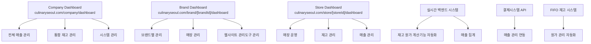

# CulinarySeoul ERP 제품 요구사항 문서 (PRD)

## 제품 개요

### 프로젝트명

CulinarySeoul 통합 ERP 시스템 구축 및 운영 관리도구 개발

### 목표

- 회사 > 브랜드 > 매장 계층구조 통합 관리 시스템 개발
- 실시간 재고관리 및 CMS 기능 통합
- 매출 관리 및 원가 시스템 최적화 및 자동화 구현
- FIFO 원칙 기반 재고 관리 및 원가 시스템
- 통합 매출관리와 재고 연동 자동 원가계산 시스템

### 기본 정보

- **회사명**: CulinarySeoul
- **메인 도메인**: culinaryseoul.com
- **첫 브랜드**: 밀랩(millab)
- **브랜드 도메인**: cafe-millab.com
- **첫 매장**: 성수점(SeongSu) - 직영점

---

## 시스템 아키텍처 개요

### 1. 계층 구조

```
CulinarySeoul (회사)
    밀랩(millab) (브랜드)
       성수점(SeongSu) (매장)
```

### 2. 기술 스택

- **프론트엔드**: Next.js 15.4.x, React 18.2.0, TypeScript 5.4.0, Tailwind CSS 3.4.0, Shadcn/ui 1.2.0
- **백엔드**: Supabase (PostgreSQL + Auth + Realtime), Redis 캐싱
- **인증**: Supabase Auth - 통합 인증 시스템 구축 후 향후 확장
- **외부 API**: Google Gemini (AI), 결제시스템 API
- **배포**: Vercel
- **품질관리**: ESLint, Playwright

> **중요 참고**: 현재 Supabase 기반으로 개발 완료 상태이며 Supabase 기반 완전 운영

### 3. 단일 도메인 기반 통합 구조

#### 3.1 도메인 구조 통합 관리

```
URL: https://culinaryseoul.com/*
   /company/dashboard     # 회사 전체 통합 관리
   /brand/[brandId]/dashboard    # 브랜드별 관리
   /store/[storeId]/dashboard    # 매장별 관리
```

### 4. 시스템 기능도



---

## 핵심 사용자 역할 관리

### 1. 시스템 계층 역할 시스템

#### 1.1 역할 계층 구조

| 역할 레벨   | 역할명        | 관리 범위   | 주요 역할              |
| ----------- | ------------- | ----------- | ---------------------- |
| **Level 1** | 슈퍼관리자    | 전체 시스템 | 시스템 설정/보안/감사  |
| **Level 2** | 회사 관리자   | 회사 전체   | 브랜드 생성/관리       |
| **Level 3** | 브랜드 관리자 | 브랜드 전체 | 매장 관리 및 운영 전략 |
| **Level 4** | 브랜드 직원   | 브랜드 전체 | 매장 관리 (제한적)     |
| **Level 5** | 매장 매니저   | 특정 매장   | 매장 일일 운영         |
| **Level 6** | 매장직원      | 특정 매장   | 매장 운영 (제한적)     |

#### 1.2 시스템 내 역할 기반 접근 시스템

```typescript
interface HybridPermissionUser {
  userId: string;
  primaryRole: UserRole; // 기본 역할
  additionalRoles: {
    // 추가 역할들
    brandId?: string;
    storeId?: string;
    role: UserRole;
    grantedAt: Date;
  }[];

  // 시스템 기본 역할 관리 시스템
  effectivePermission: UserRole; // 현재 적용 역할 레벨
  accessibleResources: string[]; // 접근 가능한 리소스들
}

// 시스템 역할 관리 시스템 기능
const determineEffectivePermission = (user: HybridPermissionUser) => {
  const allRoles = [user.primaryRole, ...user.additionalRoles.map((r) => r.role)];
  return allRoles.reduce((highest, current) =>
    getPermissionLevel(current) < getPermissionLevel(highest) ? current : highest,
  );
};
```

#### 1.3 역할별 대시보드 접근 매트릭스

| 대시보드 타입         | 슈퍼관리자  | 회사 관리자 | 브랜드 관리자    | 브랜드 직원      | 매장 매니저   | 매장직원      |
| --------------------- | ----------- | ----------- | ---------------- | ---------------- | ------------- | ------------- |
| **Company Dashboard** | 전체 접근   | 전체 접근   | 읽기 전용        | 읽기 전용        | 읽기 전용     | 읽기 전용     |
| **Brand Dashboard**   | 전체 브랜드 | 전체 브랜드 | 특정 브랜드      | 특정 브랜드      | 해당하는 매장 | 해당하는 매장 |
| **Store Dashboard**   | 전체 매장   | 전체 매장   | 브랜드 산하 매장 | 브랜드 산하 매장 | 특정 매장     | 특정 매장     |

### 2. Supabase 메타데이터 기반 사용자 관리

```typescript
// Supabase 사용자 메타데이터 구조
interface SupabaseUserMetadata {
  // 기본 역할 정보
  primaryRole: UserRole;
  companyId: string;

  // 시스템 내 역할 정보
  additionalPermissions: {
    brandIds: string[];
    storeIds: string[];
    roles: UserRole[];
  };

  // 시스템 내 접근 제한
  accessRestrictions: {
    allowedDashboards: DashboardType[];
    dataAccessLevel: AccessLevel;
    featurePermissions: FeaturePermission[];
  };

  // 역할 메타데이터
  lastPermissionUpdate: Date;
  permissionGrantedBy: string;
}

// 시스템 역할 기반 접근 제어 함수
const checkDashboardAccess = async (
  user: User,
  requestedPath: string,
  requiredPermission: Permission,
) => {
  const userMetadata = user.publicMetadata as SupabaseUserMetadata;
  const effectiveRole = determineEffectivePermission(userMetadata);

  // 경로별 역할 확인
  if (requestedPath.startsWith('/company/')) {
    return hasCompanyAccess(effectiveRole);
  } else if (requestedPath.startsWith('/brand/')) {
    const brandId = extractBrandId(requestedPath);
    return hasBrandAccess(effectiveRole, brandId, userMetadata);
  } else if (requestedPath.startsWith('/store/')) {
    const storeId = extractStoreId(requestedPath);
    return hasStoreAccess(effectiveRole, storeId, userMetadata);
  }

  return false;
};
```

---

## 핵심 시스템 기능

### 1. 단일 도메인 기반 통합 대시보드 시스템

#### 1.1 Company Dashboard (/company/dashboard)

```typescript
interface CompanyDashboardLayout {
  header: {
    companyLogo: string;
    userProfile: UserProfile;
    notifications: NotificationCenter;
    brandSwitcher: BrandSwitcher; // 시스템 브랜드 선택 UI
  };

  sidebar: {
    companyOverview: MenuItem;
    brandManagement: {
      allBrands: MenuItem;
      brandComparison: MenuItem;
      brandPerformance: MenuItem;
    };
    inventoryManagement: {
      totalInventory: MenuItem;
      crossBrandInventory: MenuItem;
      costAnalysis: MenuItem;
    };
    salesManagement: {
      totalSales: MenuItem;
      brandComparison: MenuItem;
      profitabilityAnalysis: MenuItem;
    };
    systemManagement: MenuItem; // 슈퍼관리자용
  };

  mainContent: {
    dashboardType: 'company_overview' | 'brand_detail' | 'cross_brand_analysis';
    activeFilters: BrandFilter[];
    realTimeData: boolean;
  };
}
```

#### 1.2 Brand Dashboard (/brand/[brandId]/dashboard)

```typescript
interface BrandDashboardLayout {
  header: {
    brandLogo: string;
    brandName: string;
    userProfile: UserProfile;
    parentCompanyAccess: AccessButton; // 시스템 상위 레벨 접근
  };

  sidebar: {
    brandOverview: MenuItem;
    storeManagement: MenuItem[];
    inventoryManagement: {
      currentStock: MenuItem;
      costTracking: MenuItem;
      orderManagement: MenuItem;
    };
    salesAnalysis: MenuItem;
    websiteManagement: {
      publicPages: MenuItem;
      cmsBlog: MenuItem;
      seoManagement: MenuItem;
    };
    marketingTools: MenuItem;
  };

  mainContent: {
    brandFocusedView: boolean;
    independentOperationMode: boolean; // 시스템 독립 운영 모드
  };
}
```

#### 1.3 Store Dashboard (/store/[storeId]/dashboard)

```typescript
interface StoreDashboardLayout {
  header: {
    storeName: string;
    brandContext: BrandInfo;
    userProfile: UserProfile;
    parentLevelAccess: AccessButton; // 시스템 상위 레벨 접근
  };

  sidebar: {
    storeOverview: MenuItem;
    dailyOperations: {
      salesEntry: MenuItem;
      inventoryCheck: MenuItem;
      staffManagement: MenuItem;
    };
    inventoryManagement: {
      currentStock: MenuItem;
      stockAdjustments: MenuItem;
      orderRequests: MenuItem;
    };
    salesReporting: MenuItem;
    operationalTools: MenuItem;
  };

  mainContent: {
    storeFocusedView: boolean;
    realTimeOperations: boolean;
    parentBrandIntegration: boolean;
  };
}
```

### 2. 시스템 계층 기반 데이터 접근

```typescript
class HierarchicalAccessControl {
  // 시스템 사용자 권한별 데이터 계층 기반 자동화
  async filterDataByUserPermission(
    userId: string,
    dataType: DataType,
    requestedData: any[],
  ): Promise<any[]> {
    const user = await this.getUserWithPermissions(userId);
    const effectiveRole = this.determineEffectivePermission(user);

    switch (effectiveRole) {
      case 'super_admin':
      case 'company_admin':
        // 전체 데이터 접근 허용
        return requestedData;

      case 'brand_admin':
        // 특정 브랜드 하위 범위 데이터만
        return this.filterByBrandAccess(requestedData, user.accessibleBrandIds);

      case 'store_manager':
        // 특정 매장 데이터만
        return this.filterByStoreAccess(requestedData, user.accessibleStoreIds);

      default:
        return [];
    }
  }

  // 시스템 내 역할 임시 상승 (관리자 역할 위임)
  async temporaryPermissionElevation(
    userId: string,
    targetPermission: UserRole,
    duration: number,
    reason: string,
  ): Promise<TemporaryPermission> {
    // 임시 역할 상승 기능
    const tempPermission = {
      userId,
      originalRole: await this.getUserRole(userId),
      elevatedRole: targetPermission,
      expiresAt: new Date(Date.now() + duration),
      reason,
      grantedBy: await this.getCurrentUserId(),
      active: true,
    };

    await this.grantTemporaryPermission(tempPermission);
    return tempPermission;
  }
}
```

---

## 핵심 재고 관리 기능

### 1. FIFO 재고 관리 시스템

#### 1.1 기본 기능

- 시스템 원료 재고 입고 시간순서 자동 관리
- 매출 입고 주문시, 가장 오래된 재고, 가장 오래된 계약
- 매출 수량별 자동 사용: 원료/인건비/간접비 원가 자동 산출
- 시스템 FIFO 원칙 자동 사용 및 원가 수익정확성
- 시스템 매출 연결된 원가: 재고 매출 및 원가 계산 연동
- 실시간 재고: 재고 매출 재고 차감재고 기능 실시간
- 시스템 매출 알림: AI 기반 매출 재고 알림 기능 및 추천 기능

#### 1.2 시스템 다층적인 재고 관리 기본

##### Company Dashboard 재고 관리

```typescript
interface CompanyInventoryManagement {
  // 전체 통합 재고 통합 관리
  crossBrandInventoryView: {
    totalInventoryValue: number;
    brandComparison: BrandInventoryComparison[];
    criticalAlerts: InventoryAlert[];
    consolidatedOrdering: boolean; // 통합 주문 관리
  };

  // 시스템 브랜드별 기능 재고 관리
  brandDetailedControl: {
    [brandId: string]: {
      canAdjustInventory: boolean;
      canSetRecipes: boolean;
      canApproveOrders: boolean;
      realTimeStockLevel: StockLevel[];
    };
  };
}
```

##### Brand Dashboard 재고 관리

```typescript
interface BrandInventoryManagement {
  // 브랜드 중심 재고 관리
  brandFocusedInventory: {
    storeInventories: StoreInventory[];
    brandSpecificAlerts: InventoryAlert[];
    autonomousOrdering: boolean; // 독립 주문 권한
  };

  // 회사 통합 연동
  companyIntegration: {
    syncStatus: 'connected' | 'disconnected' | 'limited';
    lastSyncTime: Date;
    pendingApprovals: OrderApproval[];
  };
}
```

##### Store Dashboard 재고 관리

```typescript
interface StoreInventoryManagement {
  // 매장 중심 재고 관리
  storeFocusedInventory: {
    currentStock: StockItem[];
    dailyUsage: UsageData[];
    reorderRequests: ReorderRequest[];
  };

  // 브랜드 통합 연동
  brandIntegration: {
    approvalRequired: boolean;
    autoReorderEnabled: boolean;
    lastOrderStatus: OrderStatus;
  };
}
```

#### 1.3 시스템 내 판매매뉴 연결된 원가 구조

##### 메뉴 기반 원가 계산 시스템

```typescript
interface SalesItemRecipe {
  id: string;
  salesItemId: string; // 판매 매뉴얼 ID
  salesItemName: string; // 매뉴얼명
  brandId: string; // 브랜드 소속
  storeId?: string; // 매장 맞춤 설정 (선택)

  ingredients: {
    rawMaterialId: string; // 원료 ID
    requiredQuantity: number; // 소요 수량
    unit: string; // 단위
    costRatio: number; // 원가 비중 (%)
  }[];
  laborCostPerUnit: number; // 인건비 단가
  overheadCostPerUnit: number; // 간접비 단가
  targetMarginRate: number; // 목표 마진율 (%)

  // 시스템 계층 관리 권한
  managedAt: 'company' | 'brand' | 'store';
  canBeOverriddenAt: ('brand' | 'store')[];

  isActive: boolean;
  version: number;
  updatedAt: Date;
  updatedBy: string;
  approvedBy?: string; // 승인자 (상위 권한)
}

// 시스템 계층 메뉴 관리
class HierarchicalRecipeManagement {
  async updateRecipe(
    recipeId: string,
    updates: Partial<SalesItemRecipe>,
    userId: string,
    requestLevel: 'company' | 'brand' | 'store',
  ) {
    const recipe = await this.getRecipe(recipeId);
    const userPermission = await this.getUserPermission(userId);

    // 권한 확인
    const canModify = this.verifyModificationPermission(
      recipe.managedAt,
      requestLevel,
      userPermission,
    );

    if (canModify) {
      // 상위 레벨 하위 레벨 직접 수정
      if (this.isHigherLevel(requestLevel, recipe.managedAt)) {
        return await this.applyRecipeUpdate(recipeId, updates, userId);
      }
      // 하위 레벨 하위 승인 요청
      else {
        return await this.submitRecipeChangeRequest(recipeId, updates, userId);
      }
    }

    throw new Error('권한이 부족합니다.');
  }
}
```

### 2. 매출 재고 연동 시스템

#### 2.1 시스템 매출 연동 자동화 재고 산출

```typescript
class AutomatedInventoryDeduction {
  async processSaleTransaction(
    saleData: SaleTransaction,
    storeId: string,
  ): Promise<InventoryDeductionResult> {
    // 1. 판매 상품별 레시피 조회
    const recipes = await this.getRecipesForSale(saleData.items);

    // 2. 각 판매 상품의 원료 소요량 계산
    const totalMaterialNeeds = this.calculateMaterialRequirements(saleData.items, recipes);

    // 3. FIFO 원칙으로 재고 차감
    const deductionResults = await Promise.all(
      totalMaterialNeeds.map((need) =>
        this.deductInventoryFIFO(need.materialId, need.quantity, storeId),
      ),
    );

    // 4. 실제 원가 계산 (차감된 재고의 실제 단가 기준)
    const actualCost = this.calculateActualCost(deductionResults);

    // 5. 원가 및 마진 실시간 업데이트
    await this.updateSaleCostAnalysis(saleData.id, {
      actualMaterialCost: actualCost.materials,
      actualLaborCost: actualCost.labor,
      actualOverheadCost: actualCost.overhead,
      actualMargin: saleData.totalPrice - actualCost.total,
      actualMarginRate: (saleData.totalPrice - actualCost.total) / saleData.totalPrice,
    });

    return {
      success: true,
      deductedLots: deductionResults,
      actualCost: actualCost,
      updatedInventoryLevels: await this.getCurrentInventoryLevels(storeId),
    };
  }

  private async deductInventoryFIFO(
    materialId: string,
    requiredQuantity: number,
    storeId: string,
  ): Promise<FIFODeductionResult> {
    // FIFO 순서로 재고 로트 조회 (가장 오래된 것부터)
    const availableLots = await this.getInventoryLotsFIFO(materialId, storeId);

    let remainingQuantity = requiredQuantity;
    const deductedLots: LotDeduction[] = [];
    let totalCost = 0;

    for (const lot of availableLots) {
      if (remainingQuantity <= 0) break;

      const deductQuantity = Math.min(remainingQuantity, lot.availableQuantity);
      const lotCost = deductQuantity * lot.unitCost;

      // 재고 차감 실행
      await this.deductFromLot(lot.id, deductQuantity);

      deductedLots.push({
        lotId: lot.id,
        deductedQuantity: deductQuantity,
        unitCost: lot.unitCost,
        totalCost: lotCost,
      });

      totalCost += lotCost;
      remainingQuantity -= deductQuantity;
    }

    if (remainingQuantity > 0) {
      throw new Error(`재고 부족: ${materialId}에서 ${remainingQuantity} 부족`);
    }

    return {
      materialId,
      totalDeducted: requiredQuantity,
      totalCost,
      averageUnitCost: totalCost / requiredQuantity,
      deductedLots,
    };
  }
}
```

---

## 핵심 데이터베이스 구조

### 1. 시스템 계층 권한 관리 테이블

```sql
-- 시스템 계층 사용자 권한 테이블
CREATE TABLE hierarchical_user_permissions (
  id UUID PRIMARY KEY DEFAULT gen_random_uuid(),
  user_id UUID REFERENCES users(id) ON DELETE CASCADE,

  -- 기본 역할 정보
  primary_role user_role_enum NOT NULL,
  company_id UUID REFERENCES companies(id) NOT NULL,

  -- 시스템 내 역할 설정
  additional_permissions JSONB DEFAULT '[]', -- 추가 역할 정보
  effective_permission user_role_enum NOT NULL, -- 현재 기본 역할

  -- 접근 가능한 리소스 목록
  accessible_brand_ids UUID[] DEFAULT '{}',
  accessible_store_ids UUID[] DEFAULT '{}',

  -- 권한 제한사항
  access_restrictions JSONB DEFAULT '{}',
  feature_permissions JSONB DEFAULT '{}',

  -- 임시 권한 상승
  temporary_elevation JSONB DEFAULT NULL,
  temp_permission_expires_at TIMESTAMP DEFAULT NULL,

  -- 메타데이터
  granted_by UUID REFERENCES users(id),
  granted_at TIMESTAMP DEFAULT NOW(),
  last_updated TIMESTAMP DEFAULT NOW(),

  INDEX idx_user_effective_permission (user_id, effective_permission),
  INDEX idx_accessible_resources (accessible_brand_ids, accessible_store_ids),
  INDEX idx_temp_permissions (temporary_elevation, temp_permission_expires_at)
);

-- 사용자 역할 열거형
CREATE TYPE user_role_enum AS ENUM (
  'super_admin',      -- 레벨 1: 슈퍼관리자
  'company_admin',    -- 레벨 2: 회사 관리자
  'brand_admin',      -- 레벨 3: 브랜드 관리자
  'brand_staff',      -- 레벨 4: 브랜드 직원
  'store_manager',    -- 레벨 5: 매장 매니저
  'store_staff'       -- 레벨 6: 매장직원
);

-- 시스템 대시보드 접근 기록
CREATE TABLE dashboard_access_logs (
  id UUID PRIMARY KEY DEFAULT gen_random_uuid(),
  user_id UUID REFERENCES users(id) ON DELETE CASCADE,

  -- 접근 정보
  dashboard_type dashboard_type_enum NOT NULL,
  accessed_path TEXT NOT NULL,
  resource_type VARCHAR(50), -- 'brand', 'store', 'inventory', etc.
  resource_id UUID,

  -- 권한 정보
  user_role_at_access user_role_enum NOT NULL,
  permission_used TEXT[],
  access_granted BOOLEAN NOT NULL,
  access_denied_reason TEXT,

  -- 보안 메타데이터
  ip_address INET,
  user_agent TEXT,
  session_id VARCHAR(500),

  -- 접근 기록
  accessed_at TIMESTAMP DEFAULT NOW(),
  duration_seconds INTEGER,

  INDEX idx_user_access_pattern (user_id, dashboard_type, accessed_at),
  INDEX idx_access_audit (access_granted, user_role_at_access, accessed_at),
  INDEX idx_resource_access (resource_type, resource_id, accessed_at)
);

-- 대시보드 유형 열거형
CREATE TYPE dashboard_type_enum AS ENUM ('company', 'brand', 'store');
```

### 2. 시스템 FIFO 재고 관리 테이블

```sql
-- 시스템 FIFO 재고 로트 관리
CREATE TABLE inventory_lots (
  id UUID PRIMARY KEY DEFAULT gen_random_uuid(),
  material_id UUID REFERENCES raw_materials(id) ON DELETE CASCADE,
  store_id UUID REFERENCES stores(id) ON DELETE CASCADE,

  -- 로트 정보
  lot_number VARCHAR(100) NOT NULL,
  supplier_id UUID REFERENCES suppliers(id),
  received_date DATE NOT NULL,
  expiry_date DATE,

  -- 수량 정보
  received_quantity DECIMAL(10,3) NOT NULL,
  available_quantity DECIMAL(10,3) NOT NULL,
  reserved_quantity DECIMAL(10,3) DEFAULT 0,
  used_quantity DECIMAL(10,3) DEFAULT 0,

  -- 원가 정보 (FIFO 현황)
  unit_cost DECIMAL(10,4) NOT NULL,
  total_cost DECIMAL(12,4) NOT NULL,
  currency VARCHAR(3) DEFAULT 'KRW',

  -- 상태
  status lot_status_enum DEFAULT 'active',

  -- 메타데이터
  created_at TIMESTAMP DEFAULT NOW(),
  updated_at TIMESTAMP DEFAULT NOW(),
  created_by UUID REFERENCES users(id),

  INDEX idx_fifo_usage (material_id, store_id, received_date, status),
  INDEX idx_expiry_tracking (expiry_date, status),
  INDEX idx_lot_search (lot_number, supplier_id)
);

-- 로트 상태 열거형
CREATE TYPE lot_status_enum AS ENUM (
  'active',         -- 사용 가능
  'reserved',       -- 예약됨
  'expired',        -- 유통기한 만료
  'damaged',        -- 손상됨
  'consumed'        -- 완전 소진됨
);

-- 시스템 매출 재고 계산 추적
CREATE TABLE auto_inventory_deductions (
  id UUID PRIMARY KEY DEFAULT gen_random_uuid(),

  -- 판매 정보
  sale_id UUID NOT NULL, -- 결제시스템 주문 ID
  sales_item_id UUID REFERENCES sales_items(id),
  quantity_sold DECIMAL(10,3) NOT NULL,

  -- 계산 기준
  recipe_id UUID REFERENCES sales_item_recipes(id),
  store_id UUID REFERENCES stores(id),

  -- FIFO 계산 결과
  lot_deductions JSONB NOT NULL, -- 로트별 계산 상세
  total_cost_deducted DECIMAL(12,4) NOT NULL,

  -- 상태
  deduction_status deduction_status_enum DEFAULT 'completed',
  error_message TEXT,

  -- 시점 정보
  sale_occurred_at TIMESTAMP NOT NULL,
  deduction_processed_at TIMESTAMP DEFAULT NOW(),

  INDEX idx_sale_deduction (sale_id, deduction_status),
  INDEX idx_store_deduction (store_id, deduction_processed_at),
  INDEX idx_recipe_usage (recipe_id, sale_occurred_at)
);

-- 계산 상태 열거형
CREATE TYPE deduction_status_enum AS ENUM (
  'pending',        -- 대기 중
  'completed',      -- 완료
  'failed',         -- 실패
  'partially_completed' -- 부분 완료
);
```

---

## 핵심 개발 일정

### Phase 1: 기본 구조 개발 (10주)

#### 1.1 기반 시스템 기본 설정 개발 (2주)

- **Week 1**: Next.js 15.4.x + Supabase 인증 기본 구축
- **Week 2**: Supabase 통합 기반 + 기본 사용자 구조

#### 1.2 계층 권한 시스템 개발 (4주)

- **Week 3-4**: Supabase 메타데이터 기반 권한 시스템
- **Week 5-6**: 다중 역할 시스템 권한 관리 시스템 기능

#### 1.3 도메인 기반 통합 구조 (4주)

- **Week 7-8**: Company/Brand/Store Dashboard 기본 구조
- **Week 9-10**: 권한 기반 접근과 데이터 자동화

### Phase 2: 재고 관리 개발 (12주)

#### 2.1 FIFO 재고 관리 시스템 (6주)

- **Week 11-12**: FIFO 원가 현황 알고리즘
- **Week 13-14**: 매출 재고 계산 시스템
- **Week 15-16**: 다층적인 재고 관리 인터페이스

#### 2.2 매출 재고 연동 시스템 (4주)

- **Week 17-18**: 매출 데이터 집계
- **Week 19-20**: 다층적인 원가 분석 도구

#### 2.3 매출 관리 기능 시스템 (2주)

- **Week 21-22**: 매출 분석 관리 기본 시스템

### Phase 3: 고급 기능 및 통합 (8주)

#### 3.1 매출 관리 시스템 완성 (4주)

- **Week 23-24**: 매출 관리 프로세스
- **Week 25-26**: 매출 분석 성과 측정

#### 3.2 외부 연동 및 AI 기능 (2주)

- **Week 27**: 결제시스템 연동
- **Week 28**: Google Gemini AI 매출 알림

#### 3.3 웹사이트 관리 시스템 (2주)

- **Week 29-30**: 매출 웹사이트 CMS

### Phase 4: 테스트 및 배포 (10주)

#### 4.1 시스템 통합 테스트 (6주)

- **Week 31-32**: 권한 시스템 통합 테스트
- **Week 33-34**: FIFO 시스템 부하 테스트
- **Week 35-36**: 매출 관리 시나리오 검증 테스트

#### 4.2 성능 최적화 및 배포 (4주)

- **Week 37-38**: 성능 최적화 및 접근 제어
- **Week 39-40**: 배포환경 배포 및 운영체제 구축

---

## 핵심 예상 비용 및 인력 일정

### 1. 기본 운영 예상

- **Supabase Pro**: $35/월
- **Vercel Pro**: $25/월
- **Redis Premium**: $30/월
- **도메인 및 SSL**: $40/년
- **모니터링 및 분석**: $20/월
- **성능 도구관리**: $15/월

**월 예상**: $150/월, **연간**: $1,843

### 2. 개발인력 (40주)

- **선임 개발팀 리더**: 1명 (풀 타임)
- **백엔드 개발자**: 0.8명 (32주)
- **프론트엔드 개발자**: 0.6명 (24주)
- **UI/UX 디자이너**: 0.5명 (20주)
- **QA 엔지니어**: 0.6명 (24주)
- **DevOps 엔지니어**: 0.3명 (12주)

---

## 핵심 보안 및 품질 관리

### 1. Supabase 기반 보안 체계

- **사용자 인증**: 다단계 인증 시스템 MFA 구축
- **API 보안**: 권한별 API 제한처리 (레이트 리미팅)
- **데이터 암호화**: 중요 데이터 전송 및 데이터 AES-256 암호화

### 2. 데이터 보안

- **암호화**: 전체 데이터 전송/저장 중 암호화 AES-256 암호화
- **백업 복구**: 로컬 권한 주기별 복구
- **API 감사**: 정기적 감사 및 데이터 접근 감사 로그

### 3. 품질 관리

- **인증검사**: 인증 권한 실시간 검사
- **취약점검사**: 취약성 주문 및 계산 취약점 검사
- **매출 모니터링**: 매출 관리 데이터 보안 관리 감사 로그

---

이 문서는 CulinarySeoul ERP 시스템의 종합적이고 체계적인 개발을 위한 요구사항과 실용적인 매출 기능과 재고관리를 통합한 완전한 시스템의 개발사항을 담고 있습니다.
