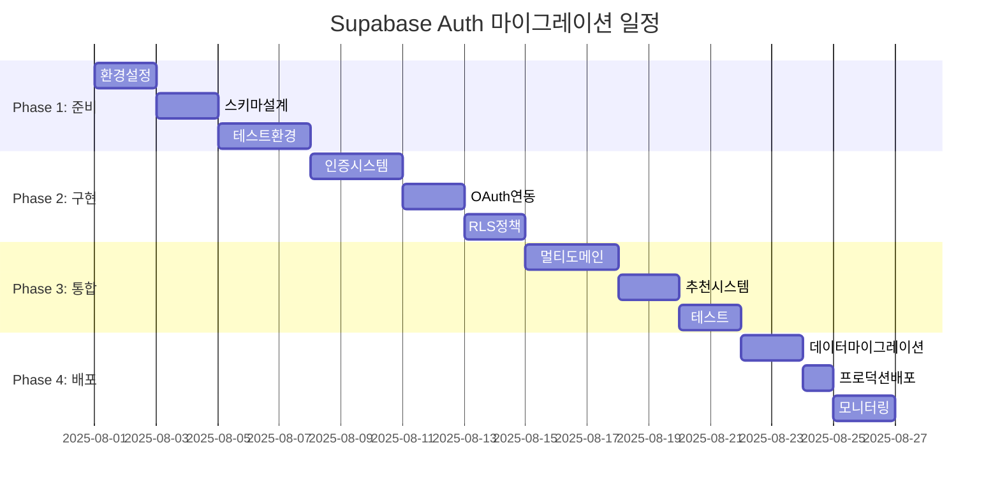

# Supabase Auth 마이그레이션 구현 가이드

**문서 버전**: 1.0  
**작성일**: 2025년 7월 30일  
**목적**: Clerk → Supabase Auth 전환을 위한 상세 구현 가이드

---

## 🎯 마이그레이션 개요

### 전환 근거

분석 결과 Supabase Auth로의 전환으로 다음과 같은 이익을 기대:

- **비용 절약**: 3년간 $53,000 절약 (83% 비용 절감)
- **기술적 우위**: RLS 기반 세밀한 권한 제어
- **확장성**: PostgreSQL 기반 무제한 확장
- **캐쉬업 최적화**: 3단계 추천 시스템 완벽 지원

---

## 📋 1. 마이그레이션 계획

### 1.1 4단계 마이그레이션 전략



### 1.2 주요 마일스톤

| 마일스톤            | 완료 기준                                | 예상 일정 | 리스크 |
| ------------------- | ---------------------------------------- | --------- | ------ |
| **M1: 환경 구축**   | Supabase 프로젝트 생성, 기본 스키마 완료 | Day 3     | 낮음   |
| **M2: 인증 구현**   | 카카오 OAuth, 세션 관리 완료             | Day 8     | 중간   |
| **M3: 시스템 통합** | 멀티도메인, 추천 시스템 연동 완료        | Day 14    | 높음   |
| **M4: 프로덕션**    | 실서비스 전환 완료                       | Day 17    | 중간   |

---

## 🏗 2. 기술 스택 변경 사항

### 2.1 패키지 변경

#### 제거할 패키지

```json
{
  "dependencies": {
    "@clerk/nextjs": "^5.15.0",
    "@clerk/themes": "^2.0.0"
  }
}
```

#### 추가할 패키지

```json
{
  "dependencies": {
    "@supabase/ssr": "^0.4.0",
    "@supabase/supabase-js": "^2.50.0"
  },
  "devDependencies": {
    "supabase": "^1.176.0"
  }
}
```

### 2.2 환경 변수 변경

#### 기존 Clerk 환경 변수 (제거)

```bash
NEXT_PUBLIC_CLERK_PUBLISHABLE_KEY=pk_test_...
CLERK_SECRET_KEY=sk_test_...
CLERK_WEBHOOK_SECRET=whsec_...
```

#### 새로운 Supabase 환경 변수 (추가)

```bash
# Supabase
NEXT_PUBLIC_SUPABASE_URL=https://your-project.supabase.co
NEXT_PUBLIC_SUPABASE_ANON_KEY=eyJ...
SUPABASE_SERVICE_ROLE_KEY=eyJ...

# Supabase Auth 설정
SUPABASE_JWT_SECRET=your-jwt-secret
NEXT_PUBLIC_SITE_URL=https://domain

# 카카오 OAuth (Supabase Dashboard에서 설정)
KAKAO_CLIENT_ID=your-kakao-rest-api-key
KAKAO_CLIENT_SECRET=your-kakao-client-secret
```

---

## 🗄 3. 데이터베이스 스키마 설계

### 3.1 핵심 테이블 구조

#### 사용자 프로필 테이블

```sql
-- Supabase Auth 사용자와 연동되는 프로필 테이블
CREATE TABLE profiles (
  id UUID REFERENCES auth.users(id) ON DELETE CASCADE PRIMARY KEY,
  email TEXT UNIQUE NOT NULL,
  name TEXT NOT NULL,
  role user_role NOT NULL DEFAULT 'creator',
  avatar_url TEXT,
  bio TEXT,
  phone TEXT,

  -- 추천 시스템 (3단계)
  referrer_l1_id UUID REFERENCES profiles(id), -- 1단계 추천인 (10%)
  referrer_l2_id UUID REFERENCES profiles(id), -- 2단계 추천인 (5%)
  referrer_l3_id UUID REFERENCES profiles(id), -- 3단계 추천인 (2%)
  referral_code TEXT UNIQUE NOT NULL DEFAULT generate_referral_code(),

  -- 본인인증 정보
  ci TEXT UNIQUE, -- 본인인증 CI (암호화)
  is_identity_verified BOOLEAN DEFAULT FALSE,

  -- 크레딧 및 수익
  credit_balance DECIMAL(10,2) DEFAULT 0,
  total_earnings DECIMAL(10,2) DEFAULT 0,

  -- 메타데이터
  created_at TIMESTAMP WITH TIME ZONE DEFAULT NOW(),
  updated_at TIMESTAMP WITH TIME ZONE DEFAULT NOW()
);

-- 사용자 역할 ENUM
CREATE TYPE user_role AS ENUM ('business', 'creator', 'admin');

-- 추천 코드 생성 함수
CREATE OR REPLACE FUNCTION generate_referral_code()
RETURNS TEXT AS $$
BEGIN
  RETURN UPPER(SUBSTRING(MD5(RANDOM()::TEXT) FROM 1 FOR 8));
END;
$$ LANGUAGE plpgsql;
```

#### 추천 수익 추적 테이블

```sql
-- 추천 수익 상세 내역
CREATE TABLE referral_earnings (
  id UUID DEFAULT gen_random_uuid() PRIMARY KEY,
  referrer_id UUID REFERENCES profiles(id) NOT NULL,
  referred_id UUID REFERENCES profiles(id) NOT NULL,
  referral_level INTEGER NOT NULL CHECK (referral_level IN (1, 2, 3)),

  -- 수익 계산
  original_amount DECIMAL(10,2) NOT NULL,
  commission_rate DECIMAL(5,4) NOT NULL, -- 0.10, 0.05, 0.02
  commission_amount DECIMAL(10,2) NOT NULL,

  -- 수익 소스
  source_type TEXT NOT NULL, -- 'campaign', 'subscription', etc.
  source_id UUID NOT NULL,

  -- 정산 상태
  status TEXT DEFAULT 'pending' CHECK (status IN ('pending', 'paid', 'cancelled')),
  paid_at TIMESTAMP WITH TIME ZONE,

  created_at TIMESTAMP WITH TIME ZONE DEFAULT NOW()
);

-- 인덱스 생성
CREATE INDEX idx_referral_earnings_referrer ON referral_earnings(referrer_id);
CREATE INDEX idx_referral_earnings_referred ON referral_earnings(referred_id);
CREATE INDEX idx_referral_earnings_status ON referral_earnings(status);
```

### 3.2 Row Level Security (RLS) 정책

#### 기본 보안 정책

```sql
-- 모든 테이블에 RLS 활성화
ALTER TABLE profiles ENABLE ROW LEVEL SECURITY;
ALTER TABLE referral_earnings ENABLE ROW LEVEL SECURITY;

-- 프로필 접근 정책
CREATE POLICY "Users can view own profile" ON profiles
FOR SELECT USING (auth.uid() = id);

CREATE POLICY "Users can update own profile" ON profiles
FOR UPDATE USING (auth.uid() = id);

-- 관리자는 모든 프로필 조회 가능
CREATE POLICY "Admins can view all profiles" ON profiles
FOR SELECT USING (
  EXISTS (
    SELECT 1 FROM profiles
    WHERE id = auth.uid() AND role = 'admin'
  )
);

-- 추천 수익 접근 정책
CREATE POLICY "Users can view own referral earnings" ON referral_earnings
FOR SELECT USING (
  auth.uid() = referrer_id OR
  auth.uid() = referred_id
);

-- 비즈니스 사용자는 자신이 생성한 캠페인 관련 수익만 조회
CREATE POLICY "Business users see campaign earnings" ON referral_earnings
FOR SELECT USING (
  EXISTS (
    SELECT 1 FROM campaigns c
    WHERE c.id::text = source_id::text
    AND c.client_id = auth.uid()
    AND source_type = 'campaign'
  )
);
```

#### 멀티도메인 지원 정책

```sql
-- 도메인별 데이터 격리 (JWT에 domain 정보 포함)
CREATE POLICY "Domain based access" ON profiles
FOR ALL USING (
  CASE
    WHEN current_setting('request.jwt.claims', true)::json->>'domain' = 'creator'
    THEN role IN ('creator', 'admin')
    WHEN current_setting('request.jwt.claims', true)::json->>'domain' = 'business'
    THEN role IN ('business', 'admin')
    WHEN current_setting('request.jwt.claims', true)::json->>'domain' = 'admin'
    THEN role = 'admin'
    ELSE true -- 메인 도메인은 모든 역할 허용
  END
);
```

---

## 🔧 4. 인증 시스템 구현

### 4.1 Supabase 클라이언트 설정

#### 서버 컴포넌트용 클라이언트

```typescript
// lib/supabase/server.ts
import { createServerClient } from '@supabase/ssr';
import { cookies } from 'next/headers';
import type { Database } from '@/types/database';

export const createClient = () => {
  const cookieStore = cookies();

  return createServerClient<Database>(
    process.env.NEXT_PUBLIC_SUPABASE_URL!,
    process.env.NEXT_PUBLIC_SUPABASE_ANON_KEY!,
    {
      cookies: {
        getAll() {
          return cookieStore.getAll();
        },
        setAll(cookiesToSet) {
          try {
            cookiesToSet.forEach(({ name, value, options }) =>
              cookieStore.set(name, value, options),
            );
          } catch {
            // Server component에서는 cookie 설정 불가
          }
        },
      },
    },
  );
};
```

#### 클라이언트 컴포넌트용 클라이언트

```typescript
// lib/supabase/client.ts
import { createBrowserClient } from '@supabase/ssr';
import type { Database } from '@/types/database';

export const createClient = () => {
  return createBrowserClient<Database>(
    process.env.NEXT_PUBLIC_SUPABASE_URL!,
    process.env.NEXT_PUBLIC_SUPABASE_ANON_KEY!,
  );
};
```

### 4.2 인증 미들웨어 구현

```typescript
// middleware.ts
import { createServerClient } from '@supabase/ssr';
import { NextResponse, type NextRequest } from 'next/server';

export async function middleware(request: NextRequest) {
  let supabaseResponse = NextResponse.next({
    request,
  });

  const supabase = createServerClient(
    process.env.NEXT_PUBLIC_SUPABASE_URL!,
    process.env.NEXT_PUBLIC_SUPABASE_ANON_KEY!,
    {
      cookies: {
        getAll() {
          return request.cookies.getAll();
        },
        setAll(cookiesToSet) {
          cookiesToSet.forEach(({ name, value, options }) => {
            request.cookies.set(name, value);
            supabaseResponse.cookies.set(name, value, options);
          });
        },
      },
    },
  );

  // 세션 갱신
  const {
    data: { user },
  } = await supabase.auth.getUser();

  // 도메인별 라우팅 로직
  const hostname = request.headers.get('host') || '';
  const url = request.nextUrl.clone();

  // 멀티도메인 처리
  if (hostname.includes('crt.')) {
    if (!user && !isPublicRoute(request.nextUrl.pathname)) {
      url.pathname = '/auth/login';
      return NextResponse.redirect(url);
    }

    // 크리에이터 권한 확인
    if (user) {
      const { data: profile } = await supabase
        .from('profiles')
        .select('role')
        .eq('id', user.id)
        .single();

      if (profile?.role !== 'creator' && profile?.role !== 'admin') {
        url.pathname = '/unauthorized';
        return NextResponse.redirect(url);
      }
    }

    url.pathname = `/creator${url.pathname}`;
    return NextResponse.rewrite(url);
  }

  // 비즈니스 도메인 처리
  if (hostname.includes('biz.')) {
    if (!user && !isPublicRoute(request.nextUrl.pathname)) {
      url.pathname = '/auth/login';
      return NextResponse.redirect(url);
    }

    if (user) {
      const { data: profile } = await supabase
        .from('profiles')
        .select('role')
        .eq('id', user.id)
        .single();

      if (profile?.role !== 'business' && profile?.role !== 'admin') {
        url.pathname = '/unauthorized';
        return NextResponse.redirect(url);
      }
    }

    url.pathname = `/business${url.pathname}`;
    return NextResponse.rewrite(url);
  }

  // 관리자 도메인 처리
  if (hostname.includes('adm.')) {
    if (!user) {
      url.pathname = '/auth/login';
      return NextResponse.redirect(url);
    }

    const { data: profile } = await supabase
      .from('profiles')
      .select('role')
      .eq('id', user.id)
      .single();

    if (profile?.role !== 'admin') {
      url.pathname = '/unauthorized';
      return NextResponse.redirect(url);
    }

    url.pathname = `/admin${url.pathname}`;
    return NextResponse.rewrite(url);
  }

  return supabaseResponse;
}

function isPublicRoute(pathname: string): boolean {
  const publicRoutes = ['/auth/login', '/auth/register', '/auth/callback', '/'];
  return publicRoutes.some((route) => pathname.startsWith(route));
}

export const config = {
  matcher: ['/((?!_next/static|_next/image|favicon.ico|.*\\.(?:svg|png|jpg|jpeg|gif|webp)$).*)'],
};
```

### 4.3 카카오 OAuth 구현

#### 기본 OAuth 플로우

```typescript
// lib/auth/kakao.ts
import { createClient } from '@/lib/supabase/client';

export async function signInWithKakao() {
  const supabase = createClient();

  const { data, error } = await supabase.auth.signInWithOAuth({
    provider: 'kakao',
    options: {
      scopes: 'profile_nickname profile_image account_email',
      redirectTo: `${process.env.NEXT_PUBLIC_SITE_URL}/auth/callback`,
    },
  });

  if (error) {
    console.error('카카오 로그인 에러:', error);
    throw error;
  }

  return data;
}

// 카카오 JavaScript SDK를 활용한 고급 구현
export async function signInWithKakaoSDK() {
  // Kakao SDK 로드
  if (!window.Kakao) {
    throw new Error('Kakao SDK가 로드되지 않았습니다.');
  }

  try {
    // 카카오 로그인
    const authObj = await new Promise((resolve, reject) => {
      window.Kakao.Auth.login({
        success: resolve,
        fail: reject,
      });
    });

    // Access Token으로 Supabase 인증
    const supabase = createClient();
    const { data, error } = await supabase.auth.signInWithIdToken({
      provider: 'kakao',
      token: authObj.access_token,
      options: {
        skipBrowserRedirect: true,
      },
    });

    if (error) throw error;

    return data;
  } catch (error) {
    console.error('카카오 SDK 로그인 에러:', error);
    throw error;
  }
}
```

#### 인증 콜백 처리

```typescript
// app/auth/callback/route.ts
import { createClient } from '@/lib/supabase/server';
import { NextRequest, NextResponse } from 'next/server';

export async function GET(request: NextRequest) {
  const { searchParams, origin } = new URL(request.url);
  const code = searchParams.get('code');
  const next = searchParams.get('next') ?? '/';
  const hostname = request.headers.get('host') || '';

  if (code) {
    const supabase = createClient();
    const { data, error } = await supabase.auth.exchangeCodeForSession(code);

    if (!error && data.user) {
      // 프로필 생성 또는 업데이트
      await createOrUpdateProfile(data.user, supabase);

      // 도메인별 리다이렉트
      const redirectUrl = getRedirectUrl(hostname, data.user.id, origin, next);
      return NextResponse.redirect(redirectUrl);
    }
  }

  // 에러 발생 시 로그인 페이지로
  return NextResponse.redirect(`${origin}/auth/login`);
}

async function createOrUpdateProfile(user: any, supabase: any) {
  const { data: existingProfile } = await supabase
    .from('profiles')
    .select('*')
    .eq('id', user.id)
    .single();

  if (!existingProfile) {
    // 새 프로필 생성
    const { error } = await supabase.from('profiles').insert({
      id: user.id,
      email: user.email,
      name: user.user_metadata?.full_name || user.email,
      avatar_url: user.user_metadata?.avatar_url,
      role: 'creator', // 기본 역할
    });

    if (error) {
      console.error('프로필 생성 에러:', error);
    }
  } else {
    // 기존 프로필 업데이트
    const { error } = await supabase
      .from('profiles')
      .update({
        email: user.email,
        avatar_url: user.user_metadata?.avatar_url,
        updated_at: new Date().toISOString(),
      })
      .eq('id', user.id);

    if (error) {
      console.error('프로필 업데이트 에러:', error);
    }
  }
}

function getRedirectUrl(hostname: string, userId: string, origin: string, next: string): string {
  // 도메인별 기본 대시보드로 리다이렉트
  if (hostname.includes('crt.')) {
    return `${origin}/dashboard`;
  } else if (hostname.includes('biz.')) {
    return `${origin}/dashboard`;
  } else if (hostname.includes('adm.')) {
    return `${origin}/admin`;
  } else {
    // 메인 도메인: 역할에 따라 적절한 서브도메인으로 리다이렉트
    // 이 부분은 사용자 역할을 조회한 후 결정
    return `${origin}${next}`;
  }
}
```

---

## 🎨 5. UI 컴포넌트 구현

### 5.1 로그인 컴포넌트

```typescript
// components/auth/login-form.tsx
'use client'

import { useState } from 'react'
import { createClient } from '@/lib/supabase/client'
import { Button } from '@/components/ui/button'
import { Input } from '@/components/ui/input'
import { Card, CardContent, CardHeader, CardTitle } from '@/components/ui/card'
import { signInWithKakao } from '@/lib/auth/kakao'

export function LoginForm() {
  const [email, setEmail] = useState('')
  const [password, setPassword] = useState('')
  const [loading, setLoading] = useState(false)
  const [message, setMessage] = useState('')

  const supabase = createClient()

  const handleEmailLogin = async (e: React.FormEvent) => {
    e.preventDefault()
    setLoading(true)
    setMessage('')

    try {
      const { error } = await supabase.auth.signInWithPassword({
        email,
        password,
      })

      if (error) throw error

      // 성공 시 리다이렉트는 미들웨어에서 처리
    } catch (error: any) {
      setMessage(error.message)
    } finally {
      setLoading(false)
    }
  }

  const handleKakaoLogin = async () => {
    setLoading(true)
    try {
      await signInWithKakao()
    } catch (error: any) {
      setMessage(error.message)
    } finally {
      setLoading(false)
    }
  }

  return (
    <Card className="w-full max-w-md mx-auto">
      <CardHeader>
        <CardTitle>캐쉬업 로그인</CardTitle>
      </CardHeader>
      <CardContent className="space-y-4">
        <form onSubmit={handleEmailLogin} className="space-y-4">
          <Input
            type="email"
            placeholder="이메일"
            value={email}
            onChange={(e) => setEmail(e.target.value)}
            required
          />
          <Input
            type="password"
            placeholder="비밀번호"
            value={password}
            onChange={(e) => setPassword(e.target.value)}
            required
          />
          <Button type="submit" className="w-full" disabled={loading}>
            {loading ? '로그인 중...' : '이메일 로그인'}
          </Button>
        </form>

        <div className="relative">
          <div className="absolute inset-0 flex items-center">
            <span className="w-full border-t" />
          </div>
          <div className="relative flex justify-center text-xs uppercase">
            <span className="bg-background px-2 text-muted-foreground">
              또는
            </span>
          </div>
        </div>

        <Button
          type="button"
          variant="outline"
          className="w-full bg-yellow-400 hover:bg-yellow-500 text-black"
          onClick={handleKakaoLogin}
          disabled={loading}
        >
          <svg className="w-5 h-5 mr-2" viewBox="0 0 24 24">
            {/* 카카오 아이콘 SVG */}
            <path d="M12 3c5.799 0 10.5 3.664 10.5 8.185 0 4.52-4.701 8.184-10.5 8.184a13.5 13.5 0 0 1-1.727-.11l-4.408 2.883c-.501.265-.678.236-.472-.413l.892-3.678c-2.88-1.46-4.785-3.99-4.785-6.866C1.5 6.665 6.201 3 12 3z"/>
          </svg>
          카카오로 시작하기
        </Button>

        {message && (
          <p className="text-sm text-red-600 text-center">{message}</p>
        )}
      </CardContent>
    </Card>
  )
}
```

### 5.2 사용자 프로필 훅

```typescript
// hooks/use-profile.ts
import { useState, useEffect } from 'react';
import { createClient } from '@/lib/supabase/client';
import type { User } from '@supabase/supabase-js';
import type { Database } from '@/types/database';

type Profile = Database['public']['Tables']['profiles']['Row'];

export function useProfile() {
  const [user, setUser] = useState<User | null>(null);
  const [profile, setProfile] = useState<Profile | null>(null);
  const [loading, setLoading] = useState(true);

  const supabase = createClient();

  useEffect(() => {
    // 현재 사용자 가져오기
    const getUser = async () => {
      const {
        data: { user },
      } = await supabase.auth.getUser();
      setUser(user);

      if (user) {
        // 프로필 정보 가져오기
        const { data: profile } = await supabase
          .from('profiles')
          .select('*')
          .eq('id', user.id)
          .single();

        setProfile(profile);
      }

      setLoading(false);
    };

    getUser();

    // 인증 상태 변경 리스너
    const {
      data: { subscription },
    } = supabase.auth.onAuthStateChange(async (event, session) => {
      if (session?.user) {
        setUser(session.user);

        const { data: profile } = await supabase
          .from('profiles')
          .select('*')
          .eq('id', session.user.id)
          .single();

        setProfile(profile);
      } else {
        setUser(null);
        setProfile(null);
      }
      setLoading(false);
    });

    return () => subscription.unsubscribe();
  }, []);

  const updateProfile = async (updates: Partial<Profile>) => {
    if (!user) return;

    const { data, error } = await supabase
      .from('profiles')
      .update(updates)
      .eq('id', user.id)
      .select()
      .single();

    if (!error && data) {
      setProfile(data);
    }

    return { data, error };
  };

  const signOut = async () => {
    await supabase.auth.signOut();
    setUser(null);
    setProfile(null);
  };

  return {
    user,
    profile,
    loading,
    updateProfile,
    signOut,
    isAuthenticated: !!user,
    isCreator: profile?.role === 'creator',
    isBusiness: profile?.role === 'business',
    isAdmin: profile?.role === 'admin',
  };
}
```

---

## 🔄 6. 추천 시스템 통합

### 6.1 추천 관계 설정

```typescript
// lib/referral/system.ts
import { createClient } from '@/lib/supabase/client';

export async function createReferralRelationship(newUserId: string, referralCode: string) {
  const supabase = createClient();

  // 추천인 찾기
  const { data: referrer } = await supabase
    .from('profiles')
    .select('id, referrer_l1_id, referrer_l2_id')
    .eq('referral_code', referralCode)
    .single();

  if (!referrer) {
    throw new Error('유효하지 않은 추천 코드입니다.');
  }

  // 추천 관계 설정
  const updates: any = {
    referrer_l1_id: referrer.id, // 1단계 추천인
  };

  // 2단계 추천인 설정
  if (referrer.referrer_l1_id) {
    updates.referrer_l2_id = referrer.referrer_l1_id;
  }

  // 3단계 추천인 설정
  if (referrer.referrer_l2_id) {
    updates.referrer_l3_id = referrer.referrer_l2_id;
  }

  const { error } = await supabase.from('profiles').update(updates).eq('id', newUserId);

  if (error) {
    throw new Error('추천 관계 설정에 실패했습니다.');
  }

  return updates;
}

export async function calculateReferralEarnings(
  userId: string,
  amount: number,
  sourceType: string,
  sourceId: string,
) {
  const supabase = createClient();

  // 사용자의 추천인들 조회
  const { data: user } = await supabase
    .from('profiles')
    .select('referrer_l1_id, referrer_l2_id, referrer_l3_id')
    .eq('id', userId)
    .single();

  if (!user) return;

  const earnings = [];

  // 1단계 추천 수익 (10%)
  if (user.referrer_l1_id) {
    const commission = amount * 0.1;
    earnings.push({
      referrer_id: user.referrer_l1_id,
      referred_id: userId,
      referral_level: 1,
      original_amount: amount,
      commission_rate: 0.1,
      commission_amount: commission,
      source_type: sourceType,
      source_id: sourceId,
    });
  }

  // 2단계 추천 수익 (5%)
  if (user.referrer_l2_id) {
    const commission = amount * 0.05;
    earnings.push({
      referrer_id: user.referrer_l2_id,
      referred_id: userId,
      referral_level: 2,
      original_amount: amount,
      commission_rate: 0.05,
      commission_amount: commission,
      source_type: sourceType,
      source_id: sourceId,
    });
  }

  // 3단계 추천 수익 (2%)
  if (user.referrer_l3_id) {
    const commission = amount * 0.02;
    earnings.push({
      referrer_id: user.referrer_l3_id,
      referred_id: userId,
      referral_level: 3,
      original_amount: amount,
      commission_rate: 0.02,
      commission_amount: commission,
      source_type: sourceType,
      source_id: sourceId,
    });
  }

  // 추천 수익 기록 저장
  if (earnings.length > 0) {
    const { error } = await supabase.from('referral_earnings').insert(earnings);

    if (error) {
      console.error('추천 수익 기록 실패:', error);
    }
  }

  return earnings;
}
```

### 6.2 수익 분배 자동화

```sql
-- 수익 발생 시 자동으로 추천 수익 계산하는 트리거
CREATE OR REPLACE FUNCTION distribute_referral_earnings()
RETURNS TRIGGER AS $$
DECLARE
  referrer_l1 UUID;
  referrer_l2 UUID;
  referrer_l3 UUID;
BEGIN
  -- 수익이 발생한 사용자의 추천인들 조회
  SELECT referrer_l1_id, referrer_l2_id, referrer_l3_id
  INTO referrer_l1, referrer_l2, referrer_l3
  FROM profiles
  WHERE id = NEW.creator_id;

  -- 1단계 추천 수익 (10%)
  IF referrer_l1 IS NOT NULL THEN
    INSERT INTO referral_earnings (
      referrer_id, referred_id, referral_level,
      original_amount, commission_rate, commission_amount,
      source_type, source_id
    ) VALUES (
      referrer_l1, NEW.creator_id, 1,
      NEW.amount, 0.10, NEW.amount * 0.10,
      'campaign', NEW.campaign_id
    );

    -- 추천인의 총 수익 업데이트
    UPDATE profiles
    SET total_earnings = total_earnings + (NEW.amount * 0.10)
    WHERE id = referrer_l1;
  END IF;

  -- 2단계 추천 수익 (5%)
  IF referrer_l2 IS NOT NULL THEN
    INSERT INTO referral_earnings (
      referrer_id, referred_id, referral_level,
      original_amount, commission_rate, commission_amount,
      source_type, source_id
    ) VALUES (
      referrer_l2, NEW.creator_id, 2,
      NEW.amount, 0.05, NEW.amount * 0.05,
      'campaign', NEW.campaign_id
    );

    UPDATE profiles
    SET total_earnings = total_earnings + (NEW.amount * 0.05)
    WHERE id = referrer_l2;
  END IF;

  -- 3단계 추천 수익 (2%)
  IF referrer_l3 IS NOT NULL THEN
    INSERT INTO referral_earnings (
      referrer_id, referred_id, referral_level,
      original_amount, commission_rate, commission_amount,
      source_type, source_id
    ) VALUES (
      referrer_l3, NEW.creator_id, 3,
      NEW.amount, 0.02, NEW.amount * 0.02,
      'campaign', NEW.campaign_id
    );

    UPDATE profiles
    SET total_earnings = total_earnings + (NEW.amount * 0.02)
    WHERE id = referrer_l3;
  END IF;

  RETURN NEW;
END;
$$ LANGUAGE plpgsql;

-- 캠페인 수익 테이블에 트리거 연결
CREATE TRIGGER trigger_distribute_referral_earnings
AFTER INSERT ON campaign_earnings
FOR EACH ROW
EXECUTE FUNCTION distribute_referral_earnings();
```

---

## 🚀 7. 배포 및 모니터링

### 7.1 환경별 설정

#### Development 환경

```bash
# .env.local
NEXT_PUBLIC_SUPABASE_URL=https://your-dev-project.supabase.co
NEXT_PUBLIC_SUPABASE_ANON_KEY=eyJ...
SUPABASE_SERVICE_ROLE_KEY=eyJ...

# 개발용 카카오 앱
KAKAO_CLIENT_ID=your-dev-kakao-key
KAKAO_CLIENT_SECRET=your-dev-kakao-secret

NEXT_PUBLIC_SITE_URL=http://localhost:3000
```

#### Production 환경

```bash
# Vercel 환경 변수
NEXT_PUBLIC_SUPABASE_URL=https://your-prod-project.supabase.co
NEXT_PUBLIC_SUPABASE_ANON_KEY=eyJ...
SUPABASE_SERVICE_ROLE_KEY=eyJ...

# 프로덕션 카카오 앱
KAKAO_CLIENT_ID=your-prod-kakao-key
KAKAO_CLIENT_SECRET=your-prod-kakao-secret

NEXT_PUBLIC_SITE_URL=https://domain
```

### 7.2 모니터링 설정

#### Supabase 대시보드 모니터링

- 인증 성공/실패율 추적
- 데이터베이스 쿼리 성능 모니터링
- RLS 정책 적중률 확인
- 사용자 활동 패턴 분석

#### 커스텀 모니터링

```typescript
// lib/monitoring/auth.ts
import { createClient } from '@/lib/supabase/client';

export async function logAuthEvent(event: string, userId?: string, metadata?: any) {
  const supabase = createClient();

  await supabase.from('auth_logs').insert({
    event,
    user_id: userId,
    metadata,
    timestamp: new Date().toISOString(),
    user_agent: navigator.userAgent,
    ip_address: await getUserIP(),
  });
}

// 사용 예시
export async function trackLoginSuccess(userId: string) {
  await logAuthEvent('login_success', userId, {
    provider: 'kakao',
    domain: window.location.hostname,
  });
}

export async function trackLoginFailure(error: string) {
  await logAuthEvent('login_failure', undefined, {
    error,
    domain: window.location.hostname,
  });
}
```

---

## ✅ 8. 테스트 계획

### 8.1 단위 테스트

```typescript
// __tests__/auth/referral.test.ts
import { createReferralRelationship, calculateReferralEarnings } from '@/lib/referral/system';

describe('추천 시스템', () => {
  test('추천 관계 생성', async () => {
    const result = await createReferralRelationship('new-user-id', 'ABC12345');

    expect(result).toHaveProperty('referrer_l1_id');
    expect(result.referrer_l1_id).toBeTruthy();
  });

  test('3단계 추천 수익 계산', async () => {
    const earnings = await calculateReferralEarnings('user-id', 10000, 'campaign', 'campaign-id');

    expect(earnings).toHaveLength(3);
    expect(earnings[0].commission_amount).toBe(1000); // 10%
    expect(earnings[1].commission_amount).toBe(500); // 5%
    expect(earnings[2].commission_amount).toBe(200); // 2%
  });
});
```

### 8.2 통합 테스트

```typescript
// __tests__/auth/integration.test.ts
import { createClient } from '@/lib/supabase/client';

describe('Supabase Auth 통합', () => {
  test('카카오 로그인 플로우', async () => {
    const supabase = createClient();

    // Mock 카카오 OAuth 응답
    const mockAuthResponse = {
      data: {
        user: {
          id: 'test-user-id',
          email: 'test@example.com',
        },
      },
      error: null,
    };

    // 로그인 테스트
    jest.spyOn(supabase.auth, 'signInWithOAuth').mockResolvedValue(mockAuthResponse);

    const response = await supabase.auth.signInWithOAuth({
      provider: 'kakao',
    });

    expect(response.data?.user?.email).toBe('test@example.com');
  });

  test('RLS 정책 검증', async () => {
    const supabase = createClient();

    // 다른 사용자의 프로필 접근 시도 (실패해야 함)
    const { data, error } = await supabase
      .from('profiles')
      .select('*')
      .eq('id', 'other-user-id')
      .single();

    expect(error).toBeTruthy();
    expect(data).toBeNull();
  });
});
```

### 8.3 E2E 테스트

```typescript
// e2e/auth.spec.ts (Playwright)
import { test, expect } from '@playwright/test';

test.describe('인증 플로우', () => {
  test('카카오 로그인', async ({ page }) => {
    await page.goto('http://localhost:3000/auth/login');

    // 카카오 로그인 버튼 클릭
    await page.click('button:has-text("카카오로 시작하기")');

    // 카카오 로그인 페이지로 리다이렉트 확인
    await expect(page).toHaveURL(/kauth.kakao.com/);

    // Mock 카카오 로그인 (테스트 환경)
    // 실제 테스트에서는 카카오 테스트 계정 사용
  });

  test('멀티도메인 접근 제어', async ({ page }) => {
    // 크리에이터 도메인에 비즈니스 사용자로 접근 시도
    await page.goto('http://crt.localhost:3000/dashboard');

    // 권한 없음 페이지로 리다이렉트 확인
    await expect(page).toHaveURL(/unauthorized/);
  });
});
```

---

## 📋 9. 체크리스트

### 9.1 구현 체크리스트

- [ ] **환경 설정**
  - [ ] Supabase 프로젝트 생성
  - [ ] 환경 변수 설정
  - [ ] 패키지 설치/제거

- [ ] **데이터베이스**
  - [ ] 사용자 테이블 생성
  - [ ] 추천 시스템 테이블 생성
  - [ ] RLS 정책 설정
  - [ ] 트리거 함수 구현

- [ ] **인증 시스템**
  - [ ] Supabase 클라이언트 설정
  - [ ] 미들웨어 구현
  - [ ] 카카오 OAuth 연동
  - [ ] 세션 관리 구현

- [ ] **UI 컴포넌트**
  - [ ] 로그인 폼
  - [ ] 회원가입 폼
  - [ ] 프로필 관리
  - [ ] 로그아웃 기능

- [ ] **추천 시스템**
  - [ ] 추천 관계 설정
  - [ ] 수익 계산 로직
  - [ ] 자동 분배 시스템
  - [ ] 추천 대시보드

### 9.2 테스트 체크리스트

- [ ] **단위 테스트**
  - [ ] 인증 함수 테스트
  - [ ] 추천 시스템 테스트
  - [ ] RLS 정책 테스트

- [ ] **통합 테스트**
  - [ ] OAuth 플로우 테스트
  - [ ] 데이터베이스 통합 테스트
  - [ ] API 엔드포인트 테스트

- [ ] **E2E 테스트**
  - [ ] 로그인/로그아웃 플로우
  - [ ] 멀티도메인 접근 제어
  - [ ] 추천 시스템 플로우

### 9.3 배포 체크리스트

- [ ] **보안**
  - [ ] 환경 변수 검증
  - [ ] RLS 정책 검토
  - [ ] API 키 보안 확인

- [ ] **성능**
  - [ ] 쿼리 최적화
  - [ ] 인덱스 설정
  - [ ] 캐싱 전략 구현

- [ ] **모니터링**
  - [ ] 로그 설정
  - [ ] 에러 추적
  - [ ] 성능 모니터링

---

## 🎯 10. 마이그레이션 완료 후 혜택

### 10.1 즉시 효과

- **비용 절감**: 월 $1,800+ 절약 (10만 MAU 기준)
- **기술적 자유도**: 완전한 제어권 확보
- **확장성**: PostgreSQL 기반 무제한 확장

### 10.2 장기적 이익

- **벤더 락인 해소**: 언제든 마이그레이션 가능
- **비즈니스 로직 최적화**: 3단계 추천 시스템 완벽 구현
- **데이터 소유권**: 완전한 데이터 제어권

### 10.3 캐쉬업 특화 이점

- **RLS 기반 멀티테넌시**: 도메인별 완벽한 데이터 격리
- **복잡한 추천 로직**: SQL 트리거로 실시간 수익 분배
- **커스텀 분석**: 자유로운 데이터 분석 및 리포팅

---

**다음 단계**: 팀 검토 → 구현 시작 → 단계적 마이그레이션 → 프로덕션 배포

이 가이드를 바탕으로 안전하고 효율적인 Supabase Auth 전환을 진행하시기 바랍니다.
