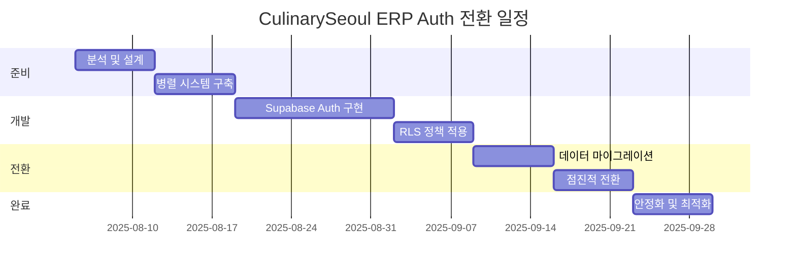
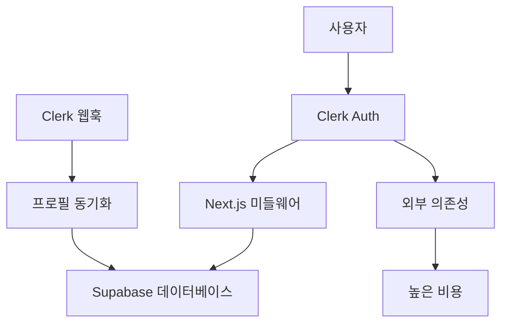
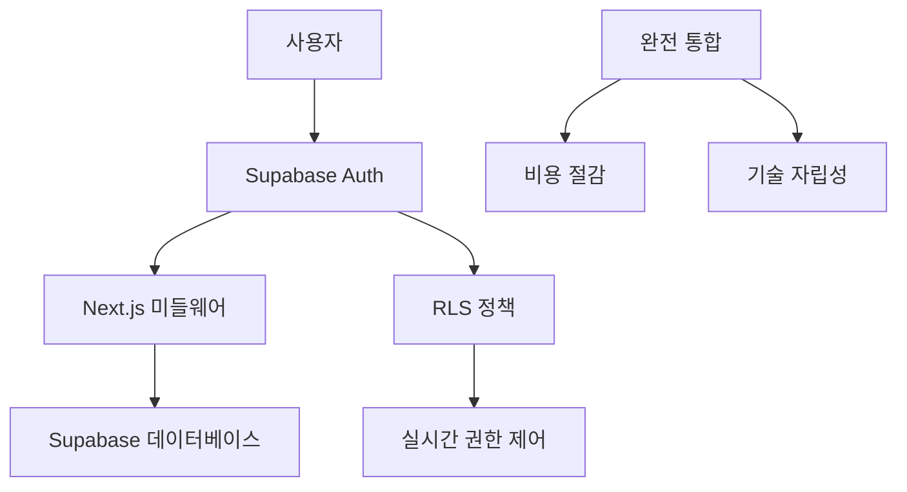

# CulinarySeoul ERP Pure Supabase Auth 전환 마이그레이션 가이드

**문서 버전**: 1.0  
**대상 프로젝트**: CulinarySeoul ERP  
**현재 시스템**: Clerk + Supabase → **목표**: Pure Supabase Auth  
**예상 절약 효과**: 월 $175+ (83% 비용 절감)

---

## 📋 전환 개요

### 현재 상황

- **인증 시스템**: Clerk (외부 의존성)
- **데이터베이스**: Supabase PostgreSQL
- **역할 시스템**: 6단계 ERP 계층 (super_admin → store_staff)
- **복잡한 동기화**: Clerk 웹훅 → Supabase 프로필

### 전환 목표

- **통합 인증**: Supabase Auth 완전 전환
- **RLS 기반 권한**: 데이터베이스 레벨 보안 제어
- **비용 최적화**: 83% 이상 운영비 절감
- **기술 자립성**: 벤더 락인 제거

---

## 🎯 비즈니스 가치

### 경제적 효과

```yaml
현재 비용 (월):
  Clerk Pro: $25 + 사용량
  Supabase Pro: $25
  총 운영비: $50-200 (사용자 수에 따라)

전환 후 비용:
  Supabase Pro: $25
  월 절약액: $25-175
  연간 절약: $300-2,100
```

### 기술적 이점

- **완전한 통합**: 인증 + 데이터 관리 단일화
- **RLS 보안**: PostgreSQL Row Level Security 활용
- **실시간 기능**: Supabase Realtime 완전 활용
- **한국 법규 준수**: 개인정보보호법 완전 대응

---

## 📚 문서 구조

### 핵심 문서

1. **[DEVELOPER_GUIDE.md](./DEVELOPER_GUIDE.md)** - 단계별 개발 구현 가이드
2. **[CODE_EXAMPLES.md](./CODE_EXAMPLES.md)** - Before/After 코드 변환 예시
3. **[CHECKLIST.md](./CHECKLIST.md)** - 마이그레이션 체크리스트
4. **[TESTING_GUIDE.md](./TESTING_GUIDE.md)** - 테스트 전략 및 검증
5. **[ROLLBACK_PLAN.md](./ROLLBACK_PLAN.md)** - 문제 발생 시 복구 계획

### 보조 자료

- **현재 분석 보고서**: `/docs/AUTH_MIGRATION_ANALYSIS.md`
- **데이터베이스 스키마**: `/src/types/database.types.ts`
- **현재 구현**: `/src/lib/clerk.ts`, `/src/middleware.ts`

---

## ⏱️ 마이그레이션 타임라인

### 전체 일정: 8주



### 주요 마일스톤

- **Week 2**: Supabase Auth 기본 설정 완료
- **Week 4**: ERP 역할 시스템 완전 구현
- **Week 6**: 데이터 마이그레이션 완료
- **Week 8**: 프로덕션 전환 및 Clerk 제거

---

## 🏗️ 아키텍처 전환

### 현재 아키텍처



### 목표 아키텍처



---

## 🔑 핵심 변경사항

### 1. 인증 플로우 변경

```typescript
// 현재 (Clerk)
const { userId } = await auth();
const profile = await supabase.from('profiles').select('*').eq('id', userId).single();

// 전환 후 (Supabase Auth)
const {
  data: { user },
} = await supabase.auth.getUser();
// RLS 정책이 자동으로 권한 확인
```

### 2. 역할 기반 접근 제어

```sql
-- RLS 정책으로 6단계 계층 구현
CREATE POLICY "erp_role_access" ON profiles
FOR ALL USING (
  CASE auth.jwt() ->> 'role'
    WHEN 'super_admin' THEN true
    WHEN 'company_admin' THEN company_id = (auth.jwt() ->> 'company_id')::uuid
    WHEN 'brand_admin' THEN brand_id = (auth.jwt() ->> 'brand_id')::uuid
    WHEN 'store_manager' THEN store_id = (auth.jwt() ->> 'store_id')::uuid
    ELSE false
  END
);
```

### 3. 실시간 기능 통합

```typescript
// 권한이 자동으로 적용되는 실시간 구독
const subscription = supabase
  .channel(`store-${storeId}`)
  .on(
    'postgres_changes',
    {
      event: '*',
      schema: 'public',
      table: 'inventory_transactions',
      filter: `store_id=eq.${storeId}`,
    },
    handleUpdate,
  )
  .subscribe(); // RLS가 자동으로 권한 확인
```

---

## ⚠️ 주요 리스크 및 완화 방안

### 기술적 리스크

| 리스크                       | 확률 | 영향도 | 완화 방안                |
| ---------------------------- | ---- | ------ | ------------------------ |
| **RLS 학습 곡선**            | 높음 | 중간   | 단계적 교육, 상세 문서화 |
| **데이터 마이그레이션 실패** | 낮음 | 높음   | 충분한 테스트, 백업 계획 |
| **성능 저하**                | 낮음 | 중간   | 사전 벤치마킹, 최적화    |

### 비즈니스 리스크

| 리스크               | 확률 | 영향도 | 완화 방안                |
| -------------------- | ---- | ------ | ------------------------ |
| **서비스 중단**      | 낮음 | 높음   | 점진적 전환, A/B 테스트  |
| **사용자 경험 저하** | 중간 | 중간   | UI/UX 일관성 유지        |
| **일정 지연**        | 중간 | 중간   | 충분한 버퍼, 단계적 접근 |

---

## 🚀 시작하기

### 즉시 준비 작업

1. **문서 검토**: 모든 마이그레이션 문서 숙지
2. **팀 교육**: PostgreSQL RLS 기본 개념 학습
3. **환경 준비**: 개발/스테이징 환경 Supabase 프로젝트 생성
4. **백업 계획**: 현재 데이터 백업 및 복구 계획 수립

### 개발 환경 설정

```bash
# 1. Supabase CLI 설치
npm install -g supabase

# 2. 프로젝트 연결
supabase init
supabase login
supabase link --project-ref YOUR_PROJECT_REF

# 3. 로컬 개발 환경 시작
supabase start

# 4. 스키마 동기화
supabase db pull
```

---

## 📞 지원 및 연락처

### 개발팀 연락처

- **프로젝트 리드**: development-lead@culinaryseoul.com
- **기술 지원**: tech-support@culinaryseoul.com
- **비상 연락**: emergency@culinaryseoul.com

### 외부 리소스

- **Supabase 공식 문서**: https://supabase.com/docs
- **RLS 가이드**: https://supabase.com/docs/guides/auth/row-level-security
- **PostgreSQL 문서**: https://www.postgresql.org/docs/

---

## 📝 체크리스트

### 전환 준비 완료 확인

- [ ] 모든 마이그레이션 문서 검토 완료
- [ ] 팀 교육 및 역량 확보
- [ ] 개발 환경 Supabase 프로젝트 생성
- [ ] 현재 시스템 완전 백업
- [ ] 테스트 시나리오 작성 완료
- [ ] 롤백 계획 수립

### 다음 단계

✅ **현재 위치**: 준비 단계  
➡️ **다음 문서**: [DEVELOPER_GUIDE.md](./DEVELOPER_GUIDE.md)

---

**⚠️ 중요**: 이 마이그레이션은 프로덕션 시스템에 중대한 영향을 미칩니다. 모든 단계를 신중히 검토하고 충분한 테스트를 거친 후 진행하세요.

**📅 최종 업데이트**: 2025년 8월 5일  
**다음 리뷰**: 마이그레이션 시작 전 전체 문서 검토
