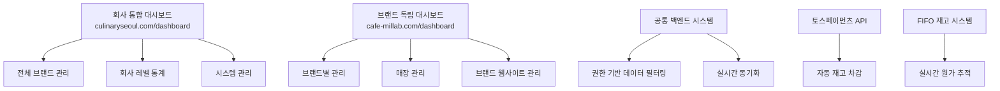
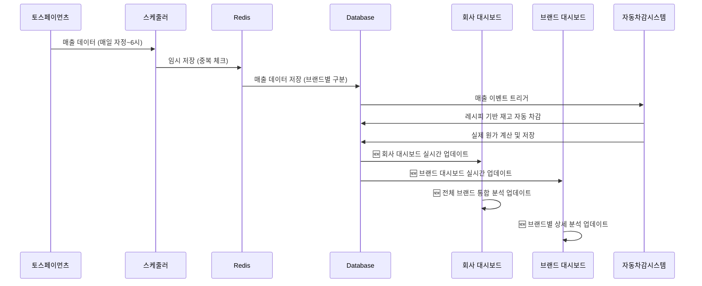

# CulinarySeoul ERP 시스템 요구사항명세서 (최종본)

## 📋 프로젝트 개요

### 프로젝트명

CulinarySeoul 통합 ERP 시스템 및 브랜드별 웹사이트 구축

### 목적

- 회사 > 브랜드 > 매장 구조의 통합 관리 시스템 구축
- 브랜드별 독립적인 웹사이트 및 CMS 블로그 운영
- 향후 브랜드 매각 시 시스템 분리 가능한 구조 설계
- FIFO 기반 정확한 재고 원가 추적 시스템
- 통합 대시보드를 통한 효율적인 멀티 브랜드 관리

### 기본 정보

- **회사명**: CulinarySeoul
- **회사 도메인**: culinaryseoul.com
- **현재 브랜드**: 밀랍(millab)
- **브랜드 도메인**: cafe-millab.com
- **현재 매장**: 성수점(SeongSu) - 직영매장

---

## 🏗️ 시스템 아키텍처

### 1. 계층 구조

```
CulinarySeoul (회사)
└── 밀랍(millab) (브랜드)
    └── 성수점(SeongSu) (직영매장)
```

### 2. 기술 스택

- **프론트엔드**: React 19, React Router 7, TypeScript, Tailwind CSS v4, Shadcn
- **백엔드**: **새로운 Supabase 프로젝트** (PostgreSQL + Auth + Realtime), Redis 캐싱
- **외부 서비스**: Google Gemini (AI), 토스페이먼츠 API
- **배포**: Vercel
- **개발 도구**: Vite 7, ESLint, Playwright

> **🚨 중요**: 기존 Supabase 프로젝트와 완전히 분리된 새로운 Supabase 프로젝트 생성 필요

### 3. 🆕 대시보드 도메인 구조

#### 3.1 회사 통합 대시보드

```
URL: https://culinaryseoul.com/dashboard
```

- **대상 사용자**: 회사 레벨 모든 권한 소유자
- **특별 기능**:
  - 회사 일반 계정이지만 **브랜드 대표 권한**이 설정된 경우
  - 회사 플랫폼에서 해당 브랜드의 **모든 관리 기능 접근 가능**
  - 멀티 브랜드 통합 관리 인터페이스

#### 3.2 브랜드별 독립 대시보드

```
URL: https://cafe-millab.com/dashboard
```

- **대상 사용자**: 해당 브랜드 및 매장 권한 소유자
- **독립성**: 브랜드별 완전 독립된 관리 환경
- **확장성**: 향후 브랜드 분리 시 그대로 이관 가능

### 4. 시스템 구성도



---

## 👥 사용자 권한 체계

### 1. 🆕 대시보드별 접근 권한 매트릭스

#### 1.1 회사 통합 대시보드 (culinaryseoul.com/dashboard)

| 사용자 유형                    | 접근 권한              | 관리 범위                            | 특별 권한                          |
| ------------------------------ | ---------------------- | ------------------------------------ | ---------------------------------- |
| **슈퍼어드민**                 | ✅ 전체 접근           | 모든 브랜드/매장                     | 시스템 설정, 브랜드 생성/삭제      |
| **회사 대표 어드민**           | ✅ 전체 접근           | 모든 브랜드/매장                     | 브랜드 관리, 사용자 관리           |
| **회사 일반 어드민**           | ✅ 제한적 접근         | 모든 브랜드/매장 (읽기 위주)         | 리포트 조회, 데이터 분석           |
| **🆕 회사 계정 + 브랜드 대표** | ✅ **하이브리드 접근** | **회사 플랫폼에서 브랜드 전체 관리** | **통합 환경에서 브랜드 완전 제어** |

#### 1.2 브랜드 독립 대시보드 (cafe-millab.com/dashboard)

| 사용자 유형        | 접근 권한        | 관리 범위                              | 브랜드 분리 시             |
| ------------------ | ---------------- | -------------------------------------- | -------------------------- |
| **브랜드 대표**    | ✅ 브랜드 전체   | 해당 브랜드 모든 매장                  | 👑 신규 독립 시스템 관리자 |
| **브랜드 담당자**  | ✅ 제한적 접근   | 해당 브랜드 (승인 권한 제외)           | 일반 관리자로 이관         |
| **매장 대표**      | ✅ 매장별 접근   | 본인 매장만                            | 매장별 독립 시 분리        |
| **매장 담당자**    | ✅ 매장별 제한   | 본인 매장 (읽기 위주)                  | 매장 직원으로 이관         |
| **🆕 회사 권한자** | ✅ **교차 접근** | **회사 권한으로 브랜드 대시보드 접근** | 접근 권한 자동 차단        |

### 2. 🆕 하이브리드 권한 시스템

#### 2.1 회사 계정 + 브랜드 대표 권한

```typescript
interface HybridPermissionUser {
  userId: string;
  companyRole: 'admin' | 'general_admin'; // 회사 레벨 권한
  brandRoles: {
    // 브랜드별 추가 권한
    brandId: string;
    role: 'brand_admin';
    grantedAt: Date;
  }[];

  // 🆕 특별 기능
  canManageBrandFromCompanyDashboard: boolean; // 회사 대시보드에서 브랜드 관리
  canAccessBrandDashboard: boolean; // 브랜드 대시보드 직접 접근
  unifiedManagementEnabled: boolean; // 통합 관리 모드
}

// 🆕 대시보드 접근 권한 체크 로직
const checkDashboardAccess = (
  user: User,
  dashboardType: 'company' | 'brand',
  targetBrandId?: string,
) => {
  if (dashboardType === 'company') {
    // 회사 대시보드: 회사 권한 필요
    return hasCompanyPermission(user);
  } else {
    // 브랜드 대시보드: 브랜드 권한 OR 회사 권한 + 브랜드 접근권
    return (
      hasBrandPermission(user, targetBrandId) ||
      (hasCompanyPermission(user) && canAccessBrandDashboard(user, targetBrandId))
    );
  }
};
```

#### 2.2 권한별 대시보드 기능 매트릭스

| 기능                   | 회사 대시보드     | 브랜드 대시보드 | 하이브리드 사용자 |
| ---------------------- | ----------------- | --------------- | ----------------- |
| **전체 브랜드 통계**   | ✅                | ❌              | ✅                |
| **브랜드별 상세 관리** | ✅ (통합뷰)       | ✅ (상세뷰)     | ✅ (양쪽 모두)    |
| **매장 관리**          | ✅ (전체)         | ✅ (브랜드 내)  | ✅ (전체)         |
| **재고 관리**          | ✅ (전체)         | ✅ (브랜드 내)  | ✅ (전체)         |
| **투입량 기입**        | ✅                | ✅              | ✅                |
| **레시피 설정**        | ✅                | ✅              | ✅                |
| **시스템 설정**        | ✅ (슈퍼어드민만) | ❌              | ✅ (슈퍼어드민만) |
| **브랜드 생성/삭제**   | ✅                | ❌              | ✅                |

---

## 🖥️ 시스템 구성

### 1. 🆕 통합 대시보드 시스템 (culinaryseoul.com/dashboard)

#### 1.1 메인 대시보드 구성

```typescript
interface CompanyDashboardLayout {
  header: {
    companyLogo: string;
    userProfile: UserProfile;
    notifications: NotificationCenter;
    brandSwitcher: BrandSwitcher; // 🆕 브랜드 빠른 전환
  };

  sidebar: {
    companyOverview: MenuItem;
    brandManagement: {
      allBrands: MenuItem;
      brandComparison: MenuItem;
      brandPerformance: MenuItem;
    };
    inventoryManagement: {
      totalInventory: MenuItem;
      crossBrandInventory: MenuItem;
      costAnalysis: MenuItem;
    };
    salesManagement: {
      totalSales: MenuItem;
      brandComparison: MenuItem;
      profitabilityAnalysis: MenuItem;
    };
    systemManagement: MenuItem; // 슈퍼어드민만
  };

  mainContent: {
    dashboardType: 'company_overview' | 'brand_detail' | 'cross_brand_analysis';
    activeFilters: BrandFilter[];
    realTimeData: boolean;
  };
}

// 🆕 브랜드 관리 통합 인터페이스
interface UnifiedBrandManagement {
  selectedBrand: string;
  managementMode: 'integrated' | 'detailed';

  // 통합 모드: 여러 브랜드 동시 관리
  integratedView: {
    multiSelectBrands: string[];
    compareMetrics: string[];
    bulkActions: BulkAction[];
  };

  // 상세 모드: 단일 브랜드 깊이 있는 관리
  detailedView: {
    fullBrandControl: boolean;
    embedBrandDashboard: boolean;
    quickActions: QuickAction[];
  };
}
```

#### 1.2 🆕 브랜드 대표 권한 통합 관리 기능

```typescript
// 회사 대시보드에서 브랜드 완전 관리
class UnifiedBrandController {
  // 브랜드 대시보드 기능을 회사 대시보드에 임베드
  async embedBrandDashboard(brandId: string, userId: string) {
    // 권한 확인: 회사 계정 + 브랜드 대표 권한
    const canManage = await this.verifyHybridPermission(userId, brandId);

    if (canManage) {
      return {
        inventoryManagement: await this.getBrandInventoryControl(brandId),
        salesManagement: await this.getBrandSalesControl(brandId),
        staffManagement: await this.getBrandStaffControl(brandId),
        websiteManagement: await this.getBrandWebsiteControl(brandId),
        // 🆕 브랜드 대시보드의 모든 기능을 통합 환경에서 제공
        fullBrandFeatures: true,
      };
    }
  }

  // 🆕 브랜드 간 빠른 전환
  async switchBrandContext(fromBrandId: string, toBrandId: string) {
    // 컨텍스트 전환 시 권한 재확인
    // 이전 브랜드 데이터 캐싱
    // 새 브랜드 데이터 로드
  }
}
```

### 2. 🆕 브랜드 독립 대시보드 (cafe-millab.com/dashboard)

#### 2.1 브랜드 전용 대시보드 구성

```typescript
interface BrandDashboardLayout {
  header: {
    brandLogo: string;
    brandName: string;
    userProfile: UserProfile;
    companyConnectionStatus: ConnectionStatus; // 🆕 본사 연결 상태
  };

  sidebar: {
    brandOverview: MenuItem;
    storeManagement: MenuItem[];
    inventoryManagement: {
      currentStock: MenuItem;
      costTracking: MenuItem;
      orderManagement: MenuItem;
    };
    salesAnalysis: MenuItem;
    websiteManagement: {
      publicPages: MenuItem;
      cmsBlog: MenuItem;
      seoManagement: MenuItem;
    };
    marketingTools: MenuItem;
  };

  mainContent: {
    brandFocusedView: boolean;
    independentOperation: boolean; // 🆕 독립 운영 모드
    separationReadiness: SeparationStatus; // 🆕 분리 준비 상태
  };
}

// 🆕 독립 운영 준비 상태
interface SeparationStatus {
  dataCompleteness: number; // 데이터 완성도 (%)
  systemReadiness: number; // 시스템 준비도 (%)
  independentCapability: number; // 독립 운영 능력 (%)
  estimatedSeparationTime: string; // 예상 분리 소요 시간
}
```

#### 2.2 🆕 교차 플랫폼 접근 제어

```typescript
class CrossPlatformAccessControl {
  // 회사 권한자의 브랜드 대시보드 접근
  async validateCompanyUserBrandAccess(userId: string, brandId: string, requestOrigin: string) {
    const user = await this.getUser(userId);
    const hasCompanyPermission = await this.hasCompanyLevelAccess(user);
    const hasBrandPermission = await this.hasBrandLevelAccess(user, brandId);

    // 접근 시나리오별 검증
    if (requestOrigin.includes('culinaryseoul.com')) {
      // 회사 대시보드에서의 접근
      return hasCompanyPermission || (hasCompanyPermission && hasBrandPermission);
    } else if (requestOrigin.includes('cafe-millab.com')) {
      // 브랜드 대시보드 직접 접근
      return hasBrandPermission || hasCompanyPermission;
    }

    return false;
  }

  // 🆕 브랜드 분리 시 접근 권한 자동 차단
  async prepareBrandSeparation(brandId: string) {
    // 회사 권한자들의 브랜드 접근 권한 임시 차단
    // 브랜드 전용 권한자들은 유지
    // 분리 완료 후 완전 차단
  }
}
```

### 3. 모바일 반응형 지원

- 모든 대시보드에서 모바일 최적화
- PWA (Progressive Web App) 지원
- 🆕 브랜드 간 전환 모바일 최적화 인터페이스

---

## 🔧 핵심 기능 명세

### 1. 재고 관리 시스템

#### 1.1 기능 상세

- **🆕 실시간 재고 현황 대시보드**: 매장별/원재료별 현재 재고 수준 시각화
- **재고 현황 조회**: 실시간 재고 수량, 안전재고 알림, 재고 회전율 분석
- **재고 입출고 관리**: 입고/출고/조정 내역 기록 및 추적
- **🆕 FIFO 기반 원가 추적**: 선입선출 방식 정확한 원가 계산
- **🆕 자동 투입량 추적**: 매출 발생 시 설정된 레시피 기반 자동 차감
- **발주 관리**: 매장 → 브랜드 → 공급업체 발주 프로세스
- **🆕 재고 예측**: AI 기반 재고 수요 예측 및 적정 재고 수준 제안

#### 1.2 🆕 대시보드별 재고 관리 기능

##### 회사 통합 대시보드에서의 재고 관리

```typescript
interface CompanyInventoryManagement {
  // 전체 브랜드 재고 통합 뷰
  crossBrandInventoryView: {
    totalInventoryValue: number;
    brandComparison: BrandInventoryComparison[];
    criticalAlerts: InventoryAlert[];
    consolidatedOrdering: boolean; // 통합 발주 기능
  };

  // 🆕 브랜드별 상세 재고 관리 (하이브리드 권한)
  brandDetailedControl: {
    [brandId: string]: {
      canAdjustInventory: boolean;
      canSetRecipes: boolean;
      canApproveOrders: boolean;
      realTimeStockLevel: StockLevel[];
    };
  };
}
```

##### 브랜드 독립 대시보드에서의 재고 관리

```typescript
interface BrandInventoryManagement {
  // 브랜드 전용 재고 관리
  brandFocusedInventory: {
    storeInventories: StoreInventory[];
    brandSpecificAlerts: InventoryAlert[];
    autonomousOrdering: boolean; // 독립적 발주 권한
  };

  // 본사 연동 정보
  companyIntegration: {
    syncStatus: 'connected' | 'disconnected' | 'limited';
    lastSyncTime: Date;
    pendingApprovals: OrderApproval[];
  };
}
```

#### 1.3 🆕 매출 아이템별 자동 투입량 추적 (업데이트)

##### 레시피 기반 자동 차감 시스템 (양쪽 대시보드 지원)

```typescript
interface SalesItemRecipe {
  id: string;
  salesItemId: string; // 매출 아이템 ID
  salesItemName: string; // 아이템명
  brandId: string; // 🆕 브랜드 구분

  ingredients: {
    rawMaterialId: string; // 원재료 ID
    requiredQuantity: number; // 필요 투입량
    unit: string; // 단위
    costRatio: number; // 원가 비율 (%)
  }[];
  laborCostPerUnit: number; // 단위당 인건비
  overheadCostPerUnit: number; // 단위당 간접비
  targetMarginRate: number; // 목표 마진율 (%)

  // 🆕 대시보드별 관리 권한
  managedFromCompanyDashboard: boolean; // 회사 대시보드에서 관리
  managedFromBrandDashboard: boolean; // 브랜드 대시보드에서 관리

  isActive: boolean;
  version: number;
  updatedAt: Date;
  updatedBy: string;
  updatedFrom: 'company' | 'brand'; // 🆕 수정 출처
}

// 🆕 대시보드별 레시피 관리 권한
class RecipeManagementController {
  async updateRecipe(
    recipeId: string,
    updates: Partial<SalesItemRecipe>,
    userId: string,
    dashboardType: 'company' | 'brand',
  ) {
    // 권한 확인
    const canManage = await this.verifyRecipeManagementPermission(userId, recipeId, dashboardType);

    if (canManage) {
      const updatedRecipe = await this.supabase
        .from('sales_item_recipes')
        .update({
          ...updates,
          updatedBy: userId,
          updatedFrom: dashboardType,
          updatedAt: new Date(),
        })
        .eq('id', recipeId);

      // 🆕 양쪽 대시보드에 변경사항 실시간 동기화
      await this.syncRecipeChanges(recipeId, dashboardType);

      return updatedRecipe;
    }
  }
}
```

#### 1.4 🆕 실시간 재고 현황 파악 기능 (업데이트)

##### 대시보드별 재고 현황 뷰

```typescript
interface InventoryDashboardView {
  // 회사 대시보드 뷰
  companyView: {
    allBrandsInventory: {
      brandId: string;
      brandName: string;
      totalInventoryValue: number;
      criticalItemsCount: number;
      stockStatus: 'healthy' | 'warning' | 'critical';
    }[];

    crossBrandComparison: {
      materialId: string;
      materialName: string;
      brandStockLevels: {
        brandId: string;
        currentStock: number;
        stockStatus: string;
      }[];
    }[];
  };

  // 브랜드 대시보드 뷰
  brandView: {
    brandInventory: {
      materialId: string;
      materialName: string;
      currentQuantity: number;
      unit: string;
      minStock: number;
      maxStock: number;
      stockStatus: 'safe' | 'low' | 'critical' | 'out_of_stock';
      daysRemaining: number;
      avgDailyUsage: number;
      lastUpdated: Date;

      // 🆕 브랜드별 특화 정보
      brandSpecificThreshold: number;
      autoReorderEnabled: boolean;
      preferredSupplier: string;
    }[];

    storeBreakdown: {
      storeId: string;
      storeName: string;
      inventoryValue: number;
      alertCount: number;
    }[];
  };
}
```

### 2. 매출관리(구현중)

#### 2.1 🆕 대시보드별 매출관리 기능 (구현 중단, 추후 개발 예정)

##### 회사 통합 대시보드 매출 관리

```typescript
interface CompanySalesManagement {
  // 전체 브랜드 매출 통합
  consolidatedSales: {
    totalRevenue: number;
    brandRevenues: BrandRevenue[];
    crossBrandComparison: SalesComparison[];
    profitabilityRanking: BrandProfitability[];
  };

  // 🆕 브랜드별 상세 매출 관리 (하이브리드 권한)
  brandSalesControl: {
    [brandId: string]: {
      canViewDetailedSales: boolean;
      canModifySalesData: boolean;
      canAccessCostData: boolean;
      realTimeProfitability: ProfitabilityData;
    };
  };
}
```

##### 브랜드 독립 대시보드 매출 관리

```typescript
interface BrandSalesManagement {
  // 브랜드 전용 매출 분석
  brandSalesData: {
    dailySales: DailySalesData[];
    itemPerformance: ItemPerformance[];
    profitMarginAnalysis: MarginAnalysis[];
    seasonalTrends: SeasonalData[];
  };

  // 본사 리포팅
  companyReporting: {
    autoReportTiming: 'real-time' | 'daily' | 'weekly';
    reportingSyncEnabled: boolean;
    lastReportSent: Date;
  };
}
```

#### 2.2 토스페이먼츠 연동 프로세스 (구현 중단, 추후 개발 예정)



### 3. 원가 관리 시스템

#### 3.1 🆕 대시보드별 원가 관리 기능

##### 회사 대시보드 원가 관리

```typescript
interface CompanyCostManagement {
  // 전체 브랜드 원가 통합 분석
  consolidatedCostAnalysis: {
    totalCostStructure: CostStructure;
    brandCostComparison: BrandCostComparison[];
    costEfficiencyRanking: CostEfficiencyRanking[];

    // 🆕 브랜드 간 원가 최적화 기회
    crossBrandOptimization: {
      sharedSupplierOpportunities: SupplierOptimization[];
      bulkPurchasingBenefits: BulkPurchasing[];
      costStandardization: CostStandardization[];
    };
  };

  // 🆕 하이브리드 권한 원가 제어
  brandCostControl: {
    [brandId: string]: {
      canSetTargetCosts: boolean;
      canAdjustCostAllocations: boolean;
      canViewDetailedCostBreakdown: boolean;
      realTimeCostTracking: RealTimeCostData;
    };
  };
}
```

##### 브랜드 대시보드 원가 관리

```typescript
interface BrandCostManagement {
  // 브랜드 전용 원가 분석
  brandCostAnalysis: {
    detailedCostBreakdown: DetailedCostBreakdown;
    itemLevelProfitability: ItemProfitability[];
    costTrends: CostTrendAnalysis[];

    // 🆕 독립 운영을 위한 원가 정보
    independentCostStructure: {
      fullyAllocatedCosts: AllocatedCosts;
      sharedCostAllocations: SharedCostAllocation[];
      separationImpactAnalysis: SeparationImpact;
    };
  };
}
```

### 4. 🆕 브랜드 웹사이트 관리 (업데이트)

#### 4.1 통합 웹사이트 관리 시스템

```typescript
interface WebsiteManagementSystem {
  // 회사 대시보드에서의 웹사이트 관리
  companyWebsiteControl: {
    allBrandWebsites: {
      brandId: string;
      domain: string;
      websiteStatus: 'active' | 'maintenance' | 'offline';
      lastUpdated: Date;
      performanceMetrics: WebsiteMetrics;
      canDirectManage: boolean; // 🆕 직접 관리 권한
    }[];

    crossBrandSEO: {
      consolidatedSEOStrategy: SEOStrategy;
      sharedContentOpportunities: ContentOpportunity[];
      brandConsistencyCheck: ConsistencyCheck[];
    };
  };

  // 브랜드 대시보드에서의 웹사이트 관리
  brandWebsiteControl: {
    independentManagement: {
      fullEditorialControl: boolean;
      contentCreationTools: ContentTools;
      seoOptimization: SEOTools;

      // 🆕 분리 준비 기능
      exportableContent: ExportableContent;
      independentHostingReady: boolean;
      domainTransferPreparation: DomainTransfer;
    };
  };
}
```

---

## 🗃️ 데이터베이스 설계

### 1. 🆕 대시보드별 권한 관리 테이블 (업데이트)

```sql
-- 🆕 대시보드 접근 권한 테이블
CREATE TABLE dashboard_access_permissions (
  id UUID PRIMARY KEY DEFAULT gen_random_uuid(),
  user_id UUID REFERENCES users(id) ON DELETE CASCADE,

  -- 대시보드별 접근 권한
  can_access_company_dashboard BOOLEAN DEFAULT false,
  can_access_brand_dashboard BOOLEAN DEFAULT false,

  -- 🆕 하이브리드 권한 설정
  hybrid_permissions JSONB DEFAULT '{}', -- 브랜드별 세부 권한

  -- 대시보드별 기능 권한
  company_dashboard_permissions JSONB DEFAULT '{}',
  brand_dashboard_permissions JSONB DEFAULT '{}',

  -- 🆕 교차 플랫폼 접근 제어
  cross_platform_access JSONB DEFAULT '{}',

  created_at TIMESTAMP DEFAULT NOW(),
  updated_at TIMESTAMP DEFAULT NOW(),

  INDEX idx_user_dashboard_access (user_id, can_access_company_dashboard, can_access_brand_dashboard)
);

-- 🆕 대시보드 세션 관리 테이블
CREATE TABLE dashboard_sessions (
  id UUID PRIMARY KEY DEFAULT gen_random_uuid(),
  user_id UUID REFERENCES users(id) ON DELETE CASCADE,
  dashboard_type dashboard_type_enum NOT NULL,
  brand_context UUID REFERENCES brands(id), -- 현재 활성 브랜드 컨텍스트

  -- 세션 정보
  session_token VARCHAR(500) UNIQUE NOT NULL,
  ip_address INET,
  user_agent TEXT,

  -- 🆕 브랜드 전환 이력
  brand_switches JSONB DEFAULT '[]',
  last_brand_switch TIMESTAMP,

  -- 세션 상태
  is_active BOOLEAN DEFAULT true,
  started_at TIMESTAMP DEFAULT NOW(),
  last_activity TIMESTAMP DEFAULT NOW(),
  expires_at TIMESTAMP,

  INDEX idx_active_sessions (user_id, dashboard_type, is_active),
  INDEX idx_brand_context (brand_context, dashboard_type)
);

-- 대시보드 타입 열거형
CREATE TYPE dashboard_type_enum AS ENUM ('company', 'brand');
```

### 2. 🆕 대시보드별 설정 관리

```sql
-- 🆕 대시보드 개인화 설정
CREATE TABLE dashboard_preferences (
  id UUID PRIMARY KEY DEFAULT gen_random_uuid(),
  user_id UUID REFERENCES users(id) ON DELETE CASCADE,
  dashboard_type dashboard_type_enum NOT NULL,
  brand_id UUID REFERENCES brands(id), -- 브랜드 대시보드인 경우

  -- 🆕 대시보드 레이아웃 설정
  layout_preferences JSONB DEFAULT '{}',
  widget_configurations JSONB DEFAULT '{}',
  default_filters JSONB DEFAULT '{}',

  -- 🆕 알림 설정
  notification_preferences JSONB DEFAULT '{}',
  alert_thresholds JSONB DEFAULT '{}',

  -- 🆕 브랜드 관리 설정 (회사 대시보드)
  brand_management_preferences JSONB DEFAULT '{}',
  favorite_brands UUID[] DEFAULT '{}',
  quick_access_features TEXT[] DEFAULT '{}',

  created_at TIMESTAMP DEFAULT NOW(),
  updated_at TIMESTAMP DEFAULT NOW(),

  UNIQUE(user_id, dashboard_type, brand_id)
);

-- 🆕 대시보드 활동 로그
CREATE TABLE dashboard_activity_logs (
  id UUID PRIMARY KEY DEFAULT gen_random_uuid(),
  user_id UUID REFERENCES users(id) ON DELETE CASCADE,
  dashboard_type dashboard_type_enum NOT NULL,
  brand_context UUID REFERENCES brands(id),

  -- 활동 정보
  activity_type activity_type_enum NOT NULL,
  activity_description TEXT,
  target_resource_type VARCHAR(50), -- 'inventory', 'sales', 'recipe', etc.
  target_resource_id UUID,

  -- 🆕 교차 대시보드 활동 추적
  originated_from dashboard_type_enum, -- 활동 시작 대시보드
  cross_dashboard_action BOOLEAN DEFAULT false,

  -- 변경 사항 (있는 경우)
  changes_made JSONB,
  previous_values JSONB,

  -- 메타데이터
  ip_address INET,
  user_agent TEXT,
  timestamp TIMESTAMP DEFAULT NOW(),

  INDEX idx_user_activity (user_id, dashboard_type, timestamp),
  INDEX idx_cross_dashboard (cross_dashboard_action, originated_from, timestamp),
  INDEX idx_resource_tracking (target_resource_type, target_resource_id, timestamp)
);

-- 활동 타입 열거형
CREATE TYPE activity_type_enum AS ENUM (
  'login', 'logout', 'view_page', 'create_record', 'update_record', 'delete_record',
  'brand_switch', 'dashboard_switch', 'export_data', 'import_data',
  'recipe_update', 'inventory_adjustment', 'order_approval', 'cost_modification'
);
```

### 3. 🆕 브랜드 분리 준비 테이블

```sql
-- 🆕 브랜드 분리 준비 상태 추적
CREATE TABLE brand_separation_readiness (
  id UUID PRIMARY KEY DEFAULT gen_random_uuid(),
  brand_id UUID REFERENCES brands(id) ON DELETE CASCADE UNIQUE,

  -- 분리 준비 상태
  separation_status separation_status_enum DEFAULT 'not_ready',
  readiness_score DECIMAL(5,2) DEFAULT 0.00, -- 0~100 점수

  -- 🆕 데이터 완성도 체크
  data_completeness JSONB DEFAULT '{}', -- 각 영역별 완성도
  critical_missing_data TEXT[] DEFAULT '{}',

  -- 🆕 시스템 독립성 체크
  system_independence JSONB DEFAULT '{}',
  dependency_issues TEXT[] DEFAULT '{}',

  -- 🆕 운영 준비도 체크
  operational_readiness JSONB DEFAULT '{}',
  staff_capability_assessment JSONB DEFAULT '{}',

  -- 분리 계획
  estimated_separation_date DATE,
  separation_complexity separation_complexity_enum,
  expected_downtime_hours INTEGER DEFAULT 0,

  -- 체크리스트
  separation_checklist JSONB DEFAULT '{}',
  completed_checklist_items TEXT[] DEFAULT '{}',

  last_assessment_date TIMESTAMP,
  assessed_by UUID REFERENCES users(id),
  created_at TIMESTAMP DEFAULT NOW(),
  updated_at TIMESTAMP DEFAULT NOW()
);

-- 분리 관련 열거형
CREATE TYPE separation_status_enum AS ENUM (
  'not_ready', 'preparing', 'ready', 'in_progress', 'completed', 'failed'
);
CREATE TYPE separation_complexity_enum AS ENUM ('low', 'medium', 'high', 'very_high');

-- 🆕 브랜드 분리 이력 추적
CREATE TABLE brand_separation_history (
  id UUID PRIMARY KEY DEFAULT gen_random_uuid(),
  brand_id UUID REFERENCES brands(id),

  -- 분리 과정 정보
  separation_started_at TIMESTAMP,
  separation_completed_at TIMESTAMP,
  separation_initiated_by UUID REFERENCES users(id),

  -- 🆕 분리된 시스템 정보
  new_supabase_project_id VARCHAR(200),
  new_domain VARCHAR(200),
  new_system_credentials JSONB, -- 암호화된 접근 정보

  -- 데이터 마이그레이션 정보
  migrated_data_summary JSONB,
  migration_verification_results JSONB,

  -- 분리 결과
  separation_success BOOLEAN,
  issues_encountered TEXT[],
  rollback_performed BOOLEAN DEFAULT false,

  -- 사후 관리
  post_separation_support_until DATE,
  support_contact_info JSONB,

  created_at TIMESTAMP DEFAULT NOW()
);
```

---

## 🔄 브랜드 분리 전략 (업데이트)

### 1. 🆕 대시보드 인식 분리 프로세스

#### Phase 0: 분리 준비도 평가

```typescript
class BrandSeparationReadinessAssessment {
  async evaluateSeparationReadiness(brandId: string): Promise<SeparationReadinessReport> {
    const assessment = {
      // 🆕 대시보드 독립성 체크
      dashboardIndependence: await this.assessDashboardIndependence(brandId),

      // 🆕 하이브리드 권한 해제 영향 평가
      hybridPermissionImpact: await this.assessHybridPermissionImpact(brandId),

      // 데이터 완성도
      dataCompleteness: await this.assessDataCompleteness(brandId),

      // 시스템 독립성
      systemIndependence: await this.assessSystemIndependence(brandId),

      // 운영 준비도
      operationalReadiness: await this.assessOperationalReadiness(brandId),
    };

    const overallScore = this.calculateReadinessScore(assessment);

    return {
      brandId,
      overallReadinessScore: overallScore,
      assessmentDetails: assessment,
      recommendations: this.generateRecommendations(assessment),
      estimatedSeparationTime: this.calculateSeparationTime(assessment),
      criticalBlockers: this.identifyCriticalBlockers(assessment),
    };
  }

  // 🆕 대시보드 독립성 평가
  private async assessDashboardIndependence(brandId: string) {
    return {
      brandDashboardCompleteness: await this.checkBrandDashboardFeatures(brandId),
      companyDashboardDependencies: await this.identifyCompanyDashboardDependencies(brandId),
      hybridUserCount: await this.countHybridPermissionUsers(brandId),
      crossPlatformDataDependencies: await this.identifyCrossPlatformDependencies(brandId),

      readinessScore: 0, // 계산됨
      blockers: [], // 식별됨
      recommendations: [], // 생성됨
    };
  }
}
```

#### Phase 1: 대시보드 준비 단계

```typescript
class DashboardSeparationPreparation {
  async prepareDashboardSeparation(brandId: string): Promise<PreparationResult> {
    // 🆕 1. 하이브리드 권한 사용자 식별 및 알림
    const hybridUsers = await this.identifyHybridUsers(brandId);
    await this.notifyHybridUsers(hybridUsers, brandId);

    // 🆕 2. 브랜드 대시보드 기능 완성도 체크
    await this.ensureBrandDashboardCompleteness(brandId);

    // 🆕 3. 회사 대시보드 의존성 제거
    await this.removeCompanyDashboardDependencies(brandId);

    // 🆕 4. 독립 운영을 위한 권한 재구성
    await this.restructurePermissionsForIndependence(brandId);

    // 5. 기존 데이터 무결성 검증
    await this.verifyDataIntegrity(brandId);

    return {
      preparationComplete: true,
      hybridUsersNotified: hybridUsers.length,
      dependenciesRemoved: true,
      dataIntegrityVerified: true,
    };
  }

  // 🆕 하이브리드 권한 사용자 처리
  private async handleHybridUsersSeparation(brandId: string, hybridUsers: HybridUser[]) {
    for (const user of hybridUsers) {
      // 옵션 1: 브랜드로 이관
      if (user.preferredAssignment === 'brand') {
        await this.transferUserToBrand(user.userId, brandId);
      }
      // 옵션 2: 회사에 유지 (브랜드 접근 권한 제거)
      else if (user.preferredAssignment === 'company') {
        await this.removeUserBrandAccess(user.userId, brandId);
      }
      // 옵션 3: 계정 분리 (두 개의 별도 계정 생성)
      else if (user.preferredAssignment === 'separate') {
        await this.createSeparateAccounts(user.userId, brandId);
      }
    }
  }
}
```

#### Phase 2: 독립 시스템 구성 (업데이트)

```typescript
class IndependentDashboardSystemCreator {
  async createIndependentDashboardSystem(
    brandData: CompleteBrandData,
  ): Promise<IndependentDashboardSystem> {
    // 1. 새로운 Supabase 프로젝트 생성
    const newProject = await this.createSupabaseProject({
      name: `${brandData.basicData.name}-erp`,
      region: 'ap-northeast-1',
      tier: 'pro',
    });

    // 🆕 2. 브랜드 독립 대시보드 설정
    const dashboardConfig = await this.setupIndependentDashboard(newProject, brandData);

    // 🆕 3. 회사 대시보드 연결 완전 차단
    await this.blockCompanyDashboardAccess(brandData.basicData.id);

    // 4. 모든 데이터 마이그레이션
    await this.migrateAllBrandData(newProject, brandData);

    // 🆕 5. 독립 운영을 위한 시스템 구성
    await this.configureIndependentOperations(newProject, dashboardConfig);

    return {
      supabaseConfig: newProject,
      dashboardConfig: dashboardConfig,
      migrationReport: await this.generateMigrationReport(brandData),
      independenceVerification: await this.verifyIndependence(newProject),
    };
  }

  // 🆕 독립 대시보드 설정
  private async setupIndependentDashboard(project: SupabaseProject, brandData: CompleteBrandData) {
    return {
      // 독립적인 도메인 설정
      domain: `${brandData.basicData.domain}/dashboard`,

      // 🆕 회사 대시보드 기능을 브랜드 대시보드로 이관
      migratedFeatures: [
        'unified_brand_management',
        'cross_brand_inventory_view',
        'company_level_reporting',
      ],

      // 독립 운영 기능 활성화
      independentFeatures: {
        autonomousUserManagement: true,
        independentSupplierManagement: true,
        selfServiceReporting: true,
        independentIntegrations: true,
      },

      // 🆕 과거 회사 연결 정보 (감사 목적)
      formerCompanyConnection: {
        companyId: brandData.basicData.companyId,
        separationDate: new Date(),
        lastSyncData: brandData.lastSyncData,
      },
    };
  }
}
```

### 2. 🆕 분리 후 시스템 독립성 검증

```typescript
class PostSeparationVerification {
  async verifyCompleteSeparation(
    originalBrandId: string,
    newProject: SupabaseProject,
    dashboardConfig: IndependentDashboardConfig,
  ): Promise<SeparationVerificationReport> {
    const verificationTests = [
      // 🆕 대시보드 독립성 검증
      this.verifyDashboardIndependence(newProject, dashboardConfig),

      // 🆕 회사 시스템과의 완전 분리 확인
      this.verifyCompanySystemSeparation(originalBrandId, newProject),

      // 데이터 무결성 검증
      this.verifyDataIntegrity(originalBrandId, newProject),

      // FIFO 계산 정확성 검증
      this.validateFIFOCalculations(newProject),

      // 자동 재고 차감 기능 검증
      this.validateAutoDeductionSystem(newProject),

      // 권한 시스템 검증
      this.validateIndependentPermissionSystem(newProject),

      // API 연동 검증
      this.validateAPIIntegrations(newProject),

      // 🆕 독립 운영 능력 검증
      this.verifyIndependentOperationalCapability(newProject),
    ];

    const results = await Promise.all(verificationTests);

    return {
      overallStatus: results.every((r) => r.success) ? 'FULLY_SEPARATED' : 'SEPARATION_ISSUES',
      verificationResults: results,
      independenceScore: this.calculateIndependenceScore(results),
      ongoingSupportNeeded: this.assessSupportNeeds(results),
      separationCompletedAt: new Date(),
    };
  }

  // 🆕 대시보드 독립성 검증
  private async verifyDashboardIndependence(
    newProject: SupabaseProject,
    dashboardConfig: IndependentDashboardConfig,
  ): Promise<VerificationResult> {
    const checks = [
      // 브랜드 대시보드가 완전히 독립적으로 작동하는지
      await this.checkBrandDashboardFunctionality(newProject),

      // 회사 대시보드에 더 이상 접근할 수 없는지
      await this.checkCompanyDashboardAccessBlocked(dashboardConfig),

      // 모든 필요한 기능이 브랜드 대시보드에 있는지
      await this.checkFeatureCompleteness(newProject, dashboardConfig),

      // 독립적인 사용자 관리가 가능한지
      await this.checkIndependentUserManagement(newProject),
    ];

    return {
      success: checks.every((check) => check.passed),
      details: checks,
      criticalIssues: checks.filter((check) => !check.passed && check.critical),
    };
  }
}
```

---

## 🚀 개발 단계별 계획 (업데이트)

### Phase 1: 기반 구조 및 대시보드 구축 (2.5개월)

#### 1.1 새로운 Supabase 프로젝트 및 대시보드 설정 (6주)

- **Week 1-2**: 새 프로젝트 생성 및 기본 스키마 설계
- **Week 3-4**: 🆕 이중 대시보드 구조 설계 및 구현
  - 회사 통합 대시보드 기본 구조
  - 브랜드 독립 대시보드 기본 구조
- **Week 5-6**: 🆕 하이브리드 권한 시스템 구현
  - 교차 플랫폼 접근 제어
  - 브랜드 컨텍스트 전환 기능

#### 1.2 권한 시스템 및 인증 (4주)

- **Week 1-2**: 복합 권한 시스템 구현
- **Week 3-4**: 🆕 대시보드별 세션 관리 및 보안

#### 1.3 프론트엔드 기반 구조 (2주)

- **Week 1-2**: 🆕 이중 대시보드 UI/UX 디자인 및 기본 컴포넌트

### Phase 2: 핵심 기능 개발 (3.5개월)

#### 2.1 🆕 통합 재고 관리 시스템 (6주)

- **Week 1-2**: FIFO 원가 계산 엔진 개발
- **Week 3-4**: 🆕 대시보드별 재고 관리 인터페이스
  - 회사 대시보드: 전체 브랜드 통합 뷰
  - 브랜드 대시보드: 브랜드별 상세 관리
- **Week 5-6**: 🆕 매출 아이템별 레시피 설정 (양쪽 대시보드 지원)

#### 2.2 🆕 실시간 대시보드 시스템 (6주)

- **Week 1-2**: 🆕 회사 통합 대시보드 개발
  - 전체 브랜드 현황 시각화
  - 브랜드 간 비교 분석
- **Week 3-4**: 🆕 브랜드 독립 대시보드 개발
  - 브랜드별 상세 분석
  - 독립 운영 준비 기능
- **Week 5-6**: 🆕 하이브리드 권한 통합 관리 기능

#### 2.3 ERP 통합 시스템 (2주)

- **Week 1**: 매출 관리 및 토스페이먼츠 연동
- **Week 2**: 원가 관리 및 손익 분석

### Phase 3: 고급 기능 및 분리 시스템 (2.5개월)

#### 3.1 🆕 브랜드 분리 시스템 (6주)

- **Week 1-2**: 분리 준비도 평가 시스템
- **Week 3-4**: 자동 분리 프로세스 구현
- **Week 5-6**: 분리 후 독립성 검증 시스템

#### 3.2 AI 및 자동화 기능 (4주)

- **Week 1-2**: Google Gemini 연동 및 예측 모델
- **Week 3-4**: 🆕 대시보드별 맞춤형 AI 기능

#### 3.3 브랜드 웹사이트 및 CMS (2주)

- **Week 1**: 브랜드 공개 페이지 및 CMS 블로그
- **Week 2**: 🆕 통합 웹사이트 관리 시스템

### Phase 4: 테스트 및 배포 (2개월)

#### 4.1 종합 테스트 (6주)

- **Week 1-2**: 🆕 이중 대시보드 시스템 통합 테스트
- **Week 3-4**: 🆕 하이브리드 권한 시스템 테스트
- **Week 5-6**: 🆕 브랜드 분리 시나리오 전체 테스트

#### 4.2 배포 및 운영 준비 (2주)

- **Week 1**: 프로덕션 배포 및 모니터링 설정
- **Week 2**: 🆕 이중 대시보드 사용자 교육 및 시스템 안정화

---

## 📊 비용 및 리소스 계획 (업데이트)

### 1. 🆕 기술 스택 비용 (업데이트)

- **새로운 Supabase Pro**: $35/월 (고성능 요구사항 증가)
- **Vercel Pro**: $25/월 (다중 도메인 및 고성능 요구)
- **Redis Premium**: $30/월 (실시간 대시보드 최적화)
- **🆕 로드 밸런서**: $20/월 (대시보드 간 트래픽 관리)
- **도메인 및 SSL**: $40/년 (추가 서브도메인)
- **모니터링 도구**: $20/월 (대시보드별 모니터링)
- **백업 스토리지**: $15/월 (증가된 데이터량)

**월간 총 비용**: $145/월, **연간**: $1,780

### 2. 🆕 개발 리소스 (최종 업데이트)

- **시니어 풀스택 개발자**: 1명 (8-10개월)
  - 복잡한 이중 대시보드 시스템 개발
- **프론트엔드 개발자**: 0.8명 (4개월)
  - 이중 대시보드 UI/UX 전문 개발
- **백엔드 개발자**: 0.8명 (4개월)
  - 복합 권한 시스템 및 API 개발
- **UI/UX 디자이너**: 0.7명 (3개월)
  - 복잡한 대시보드 인터페이스 설계
- **🆕 시스템 아키텍트**: 0.3명 (2개월)
  - 브랜드 분리 시스템 설계
- **QA 엔지니어**: 0.8명 (3개월)
  - 복합 시스템 검증 및 분리 테스트
- **DevOps 엔지니어**: 0.5명 (2개월)
  - 복잡한 배포 환경 구축

### 3. 🆕 운영 및 유지보수 계획 (업데이트)

- **월간 모니터링**:
  - 🆕 이중 대시보드 성능 및 동기화 상태 체크
  - 하이브리드 권한 시스템 보안 검토
  - FIFO 계산 정확성 및 실시간 추적 검증
- **분기별 업데이트**:
  - 🆕 대시보드 간 기능 일관성 확인
  - 브랜드 분리 준비도 평가 시스템 개선
- **연간 리뷰**:
  - 🆕 대시보드 시스템 아키텍처 최적화
  - 브랜드 분리 프로세스 개선 및 자동화 확대

---

## 🔐 보안 및 규정 준수 (업데이트)

### 1. 🆕 대시보드별 보안 강화

- **접근 제어**:
  - 🆕 대시보드별 세밀한 권한 분리
  - 하이브리드 권한 사용자 특별 모니터링
  - 교차 플랫폼 접근 로그 실시간 추적
- **데이터 격리**:
  - 🆕 대시보드별 데이터 접근 범위 엄격 제한
  - 브랜드 컨텍스트 기반 데이터 필터링
- **🆕 분리 준비 보안**:
  - 분리 예정 브랜드 데이터 사전 격리
  - 하이브리드 권한 점진적 제거 프로세스

### 2. 🆕 강화된 감사 및 로깅

- **🆕 대시보드 활동 추적**:
  - 모든 대시보드 간 전환 활동 로깅
  - 하이브리드 권한 사용 패턴 분석
  - 브랜드별 민감 데이터 접근 추적
- **🆕 분리 과정 감사**:
  - 브랜드 분리 전 과정 상세 로깅
  - 데이터 마이그레이션 무결성 검증 기록
  - 분리 후 독립성 확인 과정 문서화

### 3. 🆕 재해 복구 및 비즈니스 연속성

- **🆕 대시보드 이중화**:
  - 회사 및 브랜드 대시보드 독립적 백업
  - 하이브리드 권한 정보 실시간 복제
- **🆕 분리 과정 롤백 계획**:
  - 분리 실패 시 즉시 롤백 절차
  - 원본 시스템 무결성 보장 방안

---

## 🆕 최종 추가 기능 요약

### 1. 이중 대시보드 시스템

- **회사 통합 대시보드**: 전체 브랜드 통합 관리 및 분석
- **브랜드 독립 대시보드**: 브랜드별 독립적 운영 환경
- **하이브리드 권한**: 회사 계정으로 브랜드 완전 관리 가능

### 2. 교차 플랫폼 관리

- **컨텍스트 전환**: 브랜드 간 빠른 전환 및 통합 관리
- **통합 인터페이스**: 회사 대시보드에서 브랜드별 세부 제어
- **독립 운영 준비**: 브랜드 분리를 위한 점진적 독립성 확보

### 3. 완전한 분리 지원

- **분리 준비도 평가**: 실시간 분리 가능성 분석
- **자동 분리 프로세스**: 원클릭 브랜드 독립 시스템 구축
- **독립성 검증**: 분리 후 완전한 독립 운영 능력 확인

---

이 최종 완성된 요구사항명세서를 바탕으로 CulinarySeoul ERP 시스템을 구축하면, 효율적인 멀티 브랜드 관리와 함께 향후 브랜드 분리에도 완벽하게 대응할 수 있는 확장성 있는 시스템을 만들 수 있습니다. 특히 이중 대시보드 구조와 하이브리드 권한 시스템이 핵심 차별화 요소가 될 것입니다.
